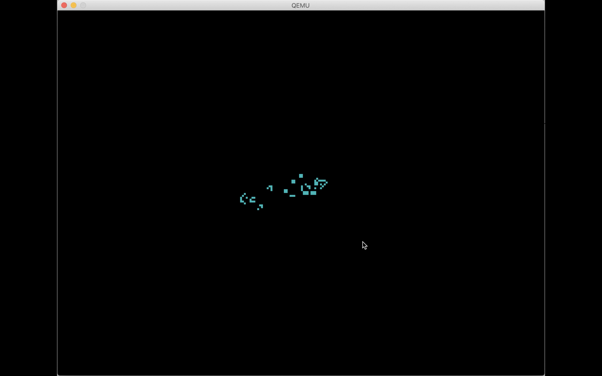

# Mu: a human-scale computer

Mu is a minimal-dependency hobbyist computing stack (everything above the
processor).

Mu is not designed to operate in large clusters providing services for
millions of people. Mu is designed for _you_, to run one computer. (Or a few.)
Running the code you want to run, and nothing else.

Here's the Mu computer running [Conway's Game of Life](https://en.wikipedia.org/wiki/Conway%27s_Game_of_Life).

```sh
$ git clone https://github.com/akkartik/mu
$ cd mu
$ ./translate life.mu  # emit a bootable code.img
$ qemu-system-i386 code.img
```



([Colorized sources.](http://akkartik.github.io/mu/html/life.mu.html)
This is memory-safe code, and most statements map to a single instruction of
machine code.)

Rather than start from some syntax and introduce layers of translation to
implement it, Mu starts from the processor's instruction set and tries to get
to _some_ safe and clear syntax with as few layers of translation as possible.
The emphasis is on internal consistency at any point in time rather than
compatibility with the past. ([More details.](http://akkartik.name/akkartik-convivial-20200607.pdf))

Tests are a key mechanism here for creating a computer that others can make
their own. I want to encourage a style of active and interactive reading with
Mu. If something doesn't make sense, try changing it and see what tests break.
Any breaking change should cause a failure in some well-named test somewhere.

Currently Mu requires a 32-bit x86 processor.

## Goals

In priority order:

- [Reward curiosity.](http://akkartik.name/about)
  - Easy to build, easy to run. [Minimal dependencies](https://news.ycombinator.com/item?id=16882140#16882555),
    so that installation is always painless.
  - All design decisions comprehensible to a single individual. (On demand.)
  - All design decisions comprehensible without needing to talk to anyone.
    (I always love talking to you, but I try hard to make myself redundant.)
  - [A globally comprehensible _codebase_ rather than locally clean code.](http://akkartik.name/post/readable-bad)
  - Clear error messages over expressive syntax.
- Safe.
  - Thorough test coverage. If you break something you should immediately see
    an error message. If you can manually test for something you should be
    able to write an automated test for it.
  - Memory leaks over memory corruption.
- Teach the computer bottom-up.

Thorough test coverage in particular deserves some elaboration. It implies
that any manual test should be easy to turn into a reproducible automated
test. Mu has some unconventional methods for providing this guarantee. It
exposes testable interfaces for hardware using dependency injection so that
tests can run on -- and make assertions against -- fake hardware. It also
performs [automated white-box testing](http://akkartik.name/post/tracing-tests)
which enables robust tests for performance, concurrency, fault-tolerance, etc.

## Non-goals

- Speed. Staying close to machine code should naturally keep Mu fast enough.
- Efficiency. Controlling the number of abstractions should naturally keep Mu
  using far less than the gigabytes of memory modern computers have.
- Portability. Mu will run on any computer as long as it's x86. I will
  enthusiastically contribute to support for other processors -- in separate
  forks. Readers shouldn't have to think about processors they don't have.
- Compatibility. The goal is to get off mainstream stacks, not to perpetuate
  them. Sometimes the right long-term solution is to [bump the major version number](http://akkartik.name/post/versioning).
- Syntax. Mu code is meant to be comprehended by [running, not just reading](http://akkartik.name/post/comprehension).
  For now it's a thin memory-safe veneer over machine code. I'm working on a
  high-level "shell" for the Mu computer.

## Toolchain

The Mu stack consists of:
- the Mu type-safe and memory-safe language;
- SubX, an unsafe notation for a subset of x86 machine code; and
- _bare_ SubX, a more rudimentary form of SubX without certain syntax sugar.

All Mu programs get translated through these layers into tiny zero-dependency
binaries that run natively. The translators for most levels are built out of
lower levels. The translator from Mu to SubX is written in SubX, and the
translator from SubX to bare SubX is built in bare SubX. There is also an
emulator for Mu's supported subset of x86, that's useful for [debugging SubX
programs](linux/subx_debugging.md).

Mu programs build natively either on Linux or on Windows using [WSL 2](https://docs.microsoft.com/en-us/windows/wsl/install-win10).
For Macs and other Unix-like systems, use the (much slower) emulator:

```sh
$ ./translate_emulated ex2.mu  # ~2 mins to emit code.img
```

Mu programs can be written for two very different environments:

* At the top-level, Mu programs emit a bootable image that runs without an OS
  (under emulation; I haven't tested on native hardware yet). There's rudimentary
  support for some core peripherals: a 1024x768 screen, a keyboard with some
  key-combinations, a PS/2 mouse that must be polled, a slow ATA disk drive.
  No hardware acceleration, no virtual memory, no process separation, no
  multi-tasking, no network. Boot always runs all tests, and only gets to
  `main` if all tests pass.

* The top-level is built using tools created under the `linux/` sub-directory.
  This sub-directory contains an entirely separate set of libraries intended
  for building programs that run with just a Linux kernel, reading from stdin
  and writing to stdout. The Mu compiler is such a program, at `linux/mu.subx`.
  Individual programs typically run tests if given a command-line argument
  called `test`.

While I currently focus on programs without an OS, the `linux/` sub-directory
is fairly ergonomic. There's a couple of dozen example programs to try out
there. It is likely to be the option for a network stack in the foreseeable
future; I have no idea how to interact on the network without Linux.

## Syntax

The entire stack shares certain properties and conventions. Programs consist
of functions and functions consist of statements, each performing a single
operation. Operands to statements are always variables or constants. You can't
perform `a + b*c` in a single statement; you have to break it up into two.
Variables can live in memory or in registers. Registers must be explicitly
specified. There are some shared lexical rules. Comments always start with
'#'. Numbers are always written in hex. Many terms can have context-dependent
_metadata_ attached after '/'.

Here's an example program in Mu:


More resources on Mu:

* [Mu Syntax reference](mu.md)

* [Library reference.](vocabulary.md) Mu programs can transparently call
  low-level functions written in SubX.

Here's an example program in SubX:

```sh
== code
Entry:
  # ebx = 1
  bb/copy-to-ebx  1/imm32
  # increment ebx
  43/increment-ebx
  # exit(ebx)
  e8/call  syscall_exit/disp32
```

More resources on SubX:

* [SubX syntax reference](subx.md)

* [Some starter exercises for learning SubX](https://github.com/akkartik/mu/pulls)
  (labelled `hello`). Feel free to [ping me](mailto:ak@akkartik.com) with any
  questions.

* The [list of x86 opcodes](subx_opcodes) supported in SubX: `linux/bootstrap/bootstrap help opcodes`.

* [Some tips for debugging SubX programs.](linux/subx_debugging.md)

## Forks

Forks of Mu are encouraged. If you don't like something about this repo, feel
free to make a fork. If you show it to me, I'll link to it here. I might even
pull features upstream!

- [mu-normie](https://git.sr.ht/~akkartik/mu-normie): with a more standard
  build system that organizes the repo by header files and compilation units.
  Stays in sync with this repo.
- [mu-x86\_64](https://git.sr.ht/~akkartik/mu-x86_64): experimental fork for
  64-bit x86 in collaboration with [Max Bernstein](https://bernsteinbear.com).
  It's brought up a few concrete open problems that I don't have good solutions
  for yet.
- [uCISC](https://github.com/grokthis/ucisc): a 16-bit processor being
  designed from scratch by [Robert Butler](https://www.youtube.com/channel/UCh4OpfF7T7UtezGejRTLxCw)
  and programmed with a SubX-like syntax.
- [subv](https://git.s-ol.nu/subv): experimental SubX-like syntax by [s-ol
  bekic](https://mmm.s-ol.nu) for the RISC-V instruction set.

## Desiderata

If you're still reading, here are some more things to check out:

- [How to get your text editor set up for Mu and SubX programs.](editor/editor.md)

- [Some 2-minute videos demonstrating Mu programs](https://archive.org/details/@kartik_agaram).
  Many of them involve this prototype live-updating programming environment
  for a postfix language that I might work on again one day:

  ```sh
  $ cd linux
  $ ./translate tile/*.mu
  $ ./a.elf screen
  ```

- [A summary](mu_instructions) of how the Mu compiler translates statements
  to SubX. Most Mu statements map to a single x86 instruction.
  ([colorized version](http://akkartik.github.io/mu/html/mu_instructions.html))

- [Some details on the unconventional organization of this project.](http://akkartik.name/post/four-repos)

- Previous prototypes: [mu0](https://github.com/akkartik/mu0), [mu1](https://github.com/akkartik/mu1).

## Credits

Mu builds on many ideas that have come before, especially:

- [Peter Naur](http://akkartik.name/naur.pdf) for articulating the paramount
  problem of programming: communicating a codebase to others;
- [Christopher Alexander](http://www.amazon.com/Notes-Synthesis-Form-Harvard-Paperbacks/dp/0674627512)
  and [Richard Gabriel](https://www.dreamsongs.com/Files/PatternsOfSoftware.pdf) for
  the intellectual tools for reasoning about the higher order design of a
  codebase;
- [David Parnas](http://www.cs.umd.edu/class/spring2003/cmsc838p/Design/criteria.pdf)
  and others for highlighting the value of separating concerns and stepwise
  refinement;
- The folklore of debugging by print and the trace facility in many Lisp
  systems;
- Automated tests for showing the value of developing programs inside an
  elaborate harness;

On a more tactical level, this project has made progress in a series of bursts
as I discovered the following resources. In autobiographical order, with no
claims of completeness:
- [&ldquo;Bootstrapping a compiler from nothing&rdquo;](http://web.archive.org/web/20061108010907/http://www.rano.org/bcompiler.html) by Edmund Grumley-Evans.
- [StoneKnifeForth](https://github.com/kragen/stoneknifeforth) by [Kragen Sitaker](http://canonical.org/~kragen),
  including [a tiny sketch of an ELF loader](https://github.com/kragen/stoneknifeforth/blob/master/386.c).
- [&ldquo;Creating tiny ELF executables&rdquo;](https://www.muppetlabs.com/~breadbox/software/tiny/teensy.html) by Brian Raiter.
- [Single-page cheatsheet for the x86 ISA](https://net.cs.uni-bonn.de/fileadmin/user_upload/plohmann/x86_opcode_structure_and_instruction_overview.pdf)
  by Daniel Plohmann ([cached local copy](https://github.com/akkartik/mu/blob/main/cheatsheet.pdf))
- [Minimal Linux Live](http://minimal.linux-bg.org) for teaching how to create
  a bootable disk image using the syslinux bootloader.
- [&ldquo;Writing a bootloader from scratch&rdquo;](https://www.cs.bham.ac.uk/~exr/lectures/opsys/10_11/lectures/os-dev.pdf)
  by Nick Blundell.
- Wikipedia on BIOS interfaces: [Int 10h](https://en.wikipedia.org/wiki/INT_10H), [Int 13h](https://en.wikipedia.org/wiki/INT_13H).
- [Some tips on programming bootloaders](https://stackoverflow.com/questions/43786251/int-13h-42h-doesnt-load-anything-in-bochs/43787939#43787939)
  by Michael Petch.
- [xv6, the port of Unix Version 6 to x86 processors](https://github.com/mit-pdos/xv6-public)
- Some tips on handling keyboard interrupts by [Alex Dzyoba](https://alex.dzyoba.com/blog/os-interrupts)
  and [Michael Petch](https://stackoverflow.com/questions/37618111/keyboard-irq-within-an-x86-kernel).
