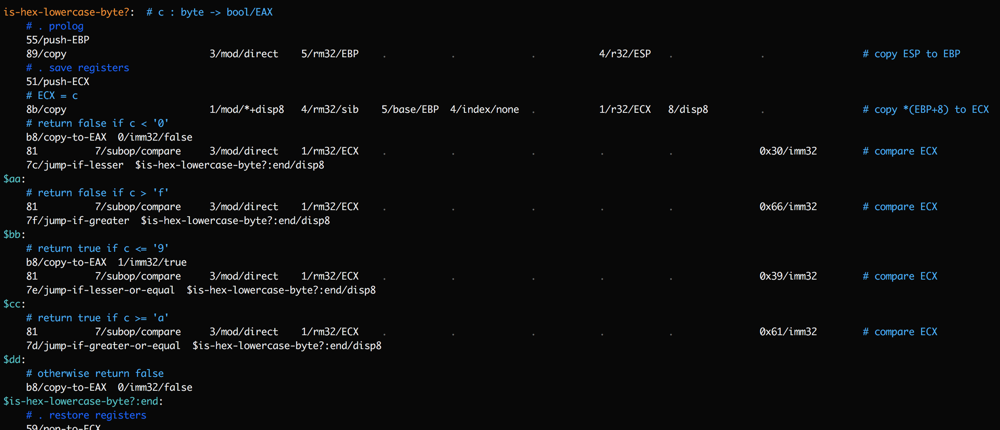

# Mu: a human-scale computer

Mu is a minimal-dependency hobbyist computing stack (everything above the
processor and OS kernel).

Mu is not designed to operate in large clusters providing services for
millions of people. Mu is designed for _you_, to run one computer. (Or a few.)
Running the code you want to run, and nothing else.

  ```sh
  $ git clone https://github.com/akkartik/mu
  $ cd mu
  $ ./translate_mu apps/ex2.mu  # emits a.elf
  $ ./a.elf  # adds 3 and 4
  $ echo $?
  7
  ```

[](https://travis-ci.org/akkartik/mu)

The Mu translator is built up from machine code and requires just a Unix-like
kernel and nothing else. You can also bootstrap it from C++. Both C++ and
self-hosted versions emit identical binaries. The generated binaries require
just a Unix-like kernel and nothing else.

## Goals

In priority order:

* [Reward curiosity.](http://akkartik.name/about)
  * Easy to build, easy to run. [Minimal dependencies](https://news.ycombinator.com/item?id=16882140#16882555),
    so that installation is always painless.
  * All design decisions comprehensible to a single individual. (On demand.)
  * All design decisions comprehensible without needing to talk to anyone.
    (I always love talking to you, but I try hard to make myself redundant.)
  * [A globally comprehensible _codebase_ rather than locally clean code.](http://akkartik.name/post/readable-bad)
  * Clear error messages over expressive syntax.
* Safe.
  * Thorough test coverage. If you break something you should immediately see
    an error message. If you can manually test for something you should be
    able to write an automated test for it.
  * Memory leaks over memory corruption.
* Teach the computer bottom-up.

## Non-goals

* Efficiency. Clear programs over fast programs.
* Portability. Runs on any computer as long as it's x86.
* Compatibility. The goal is to get off mainstream stacks, not to perpetuate
  them. Sometimes the right long-term solution is to [bump the major version number](http://akkartik.name/post/versioning).
* Syntax. Mu code is meant to be comprehended by [running, not just reading](http://akkartik.name/post/comprehension).
  For now it's a thin veneer over machine code. I'm working on memory safety
  before expressive syntax.

## Source Language

Mu's main source language is [still being built](http://akkartik.name/post/mu-2019-2).
When completed, it will be type- and memory-safe. At the moment it performs no
checks and only supports variables of type `int`. Here's the program we
translated above:


There are no expressions, only statements that operate on variables. Most
statements in Mu translate to a single machine code instruction. Variables
reside in memory by default. Programs must specify registers when they want to
use them. Functions must return results in registers. Execution begins at the
function `main`, which always returns its result in register `ebx`. [This post](http://akkartik.name/post/mu-2019-2)
has more details. You can see a complete list of supported instructions and
their translations in [this summary](mu_instructions).

## SubX

Mu is written in [a notation for a subset of x86 machine code called SubX](http://akkartik.name/post/mu-2019-1).
Here's a program (`apps/ex1.subx`) that returns 42:

  ```sh
  bb/copy-to-ebx  0x2a/imm32  # 42 in hex
  b8/copy-to-eax  1/imm32/exit
  cd/syscall  0x80/imm8
  ```

You can generate tiny zero-dependency ELF binaries from SubX that run on Linux.

  ```sh
  $ ./bootstrap translate init.linux apps/ex1.subx -o apps/ex1  # on Linux or BSD or Mac
  $ ./apps/ex1  # only on Linux
  $ echo $?
  42
 ```

(Running `bootstrap` requires a C++ compiler, transparently invoking it as
necessary.)

You can run the generated binaries on an interpreter/VM for better error
messages.

  ```sh
  $ ./bootstrap run apps/ex1  # on Linux or BSD or Mac
  $ echo $?
  42
  ```

Emulated runs can generate a trace that permits [time-travel debugging](https://github.com/akkartik/mu/blob/master/tools/browse_trace.readme.md).

  ```sh
  $ ./bootstrap --debug translate init.linux apps/factorial.subx -o apps/factorial
  saving address->label information to 'labels'
  saving address->source information to 'source_lines'

  $ ./bootstrap --trace run apps/factorial
  saving trace to 'last_run'

  $ tools/browse_trace last_run  # text-mode debugger UI
  ```

You can write tests for your programs. The entire stack is thoroughly covered
by automated tests. SubX's tagline: tests before syntax.

  ```sh
  $ ./bootstrap test
  $ ./bootstrap run apps/factorial test
  ```

You can use SubX to translate itself. For example, running natively on Linux:

  ```sh
  # generate translator phases using the C++ translator
  $ ./bootstrap translate init.linux 0*.subx apps/subx-params.subx apps/hex.subx    -o hex
  $ ./bootstrap translate init.linux 0*.subx apps/subx-params.subx apps/survey.subx -o survey
  $ ./bootstrap translate init.linux 0*.subx apps/subx-params.subx apps/pack.subx   -o pack
  $ ./bootstrap translate init.linux 0*.subx apps/subx-params.subx apps/assort.subx -o assort
  $ ./bootstrap translate init.linux 0*.subx apps/subx-params.subx apps/dquotes.subx -o dquotes
  $ ./bootstrap translate init.linux 0*.subx apps/subx-params.subx apps/tests.subx  -o tests
  $ chmod +x hex survey pack assort dquotes tests

  # use the generated translator phases to translate SubX programs
  $ cat init.linux apps/ex1.subx |./tests |./dquotes |./assort |./pack |./survey |./hex > a.elf
  $ chmod +x a.elf
  $ ./a.elf
  $ echo $?
  42

  # or, automating the above steps
  $ ./translate_subx init.linux apps/ex1.subx
  $ ./a.elf
  $ echo $?
  42
  ```

Or, running in a VM on other platforms (much slower):

  ```sh
  $ ./translate_subx_emulated init.linux apps/ex1.subx  # generates identical a.elf to above
  $ ./bootstrap run a.elf
  $ echo $?
  42
  ```

You can package up SubX binaries with the minimal hobbyist OS [Soso](https://github.com/ozkl/soso)
and run them on Qemu. (Requires graphics and sudo access. Currently doesn't
work on a cloud server.)

  ```sh
  # dependencies
  $ sudo apt install build-essential util-linux nasm xorriso  # maybe also dosfstools and mtools
  # package up a "hello world" program with a third-party kernel into mu_soso.iso
  # requires sudo
  $ tools/iso/soso init.soso apps/ex6.subx
  # try it out
  $ qemu-system-i386 -cdrom mu_soso.iso
  ```

You can also package up SubX binaries with a Linux kernel and run them on
either Qemu or [a cloud server that supports custom images](http://akkartik.name/post/iso-on-linode).
(Takes 12 minutes with 2GB RAM. Requires 12 million LoC of C for the Linux
kernel; that number will gradually go down.)

  ```sh
  $ sudo apt install build-essential flex bison wget libelf-dev libssl-dev xorriso
  $ tools/iso/linux init.linux apps/ex6.subx
  $ qemu-system-x86_64 -m 256M -cdrom mu_linux.iso -boot d
  ```

## The syntax of SubX instructions

Here is the above SubX example again:

  ```sh
  bb/copy-to-ebx  0x2a/imm32  # 42 in hex
  b8/copy-to-eax  1/imm32/exit
  cd/syscall  0x80/imm8
  ```

Every line contains at most one instruction. Instructions consist of words
separated by whitespace. Words may be _opcodes_ (defining the operation being
performed) or _arguments_ (specifying the data the operation acts on). Any
word can have extra _metadata_ attached to it after `/`. Some metadata is
required (like the `/imm32` and `/imm8` above), but unrecognized metadata is
silently skipped so you can attach comments to words (like the instruction
name `/copy-to-eax` above, or the `/exit` argument).

What do all these numbers mean? SubX supports a small subset of the 32-bit x86
instruction set that likely runs on your computer. (Think of the name as short
for "sub-x86".) The instruction set contains instructions like `89/copy`,
`01/add`, `3d/compare` and `51/push-ecx` which modify registers and a byte-addressable
memory. For a complete list of supported instructions, run `bootstrap help opcodes`.

The registers instructions operate on are as follows:

* Six general-purpose 32-bit registers: `0/eax`, `1/ebx`, `2/ecx`, `3/edx`,
  `6/esi` and `7/edi`.
* Two additional 32-bit registers: `4/esp` and `5/ebp`. (I suggest you only
  use these to manage the call stack.)

(SubX doesn't support floating-point registers yet. Intel processors support
an 8-bit mode, 16-bit mode and 64-bit mode. SubX will never support them.
There are also _many_ more instructions that SubX will never support.)

While SubX doesn't provide the usual mnemonics for opcodes, it _does_ provide
error-checking. If you miss an argument or accidentally add an extra argument,
you'll get a nice error. SubX won't arbitrarily interpret bytes of data as
instructions or vice versa.

It's worth distinguishing between an instruction's arguments and its _operands_.
Arguments are provided directly in instructions. Operands are pieces of data
in register or memory that are operated on by instructions.

Intel processors typically operate on no more than two operands, and at most
one of them (the 'reg/mem' operand) can access memory. The address of the
reg/mem operand is constructed by expressions of one of these forms:

  * `%reg`: operate on just a register, not memory
  * `*reg`: look up memory with the address in some register
  * `*(reg + disp)`: add a constant to the address in some register
  * `*(base + (index << scale) + disp)` where `base` and `index` are registers,
    and `scale` and `disp` are 2- and 32-bit constants respectively.

Under the hood, SubX turns expressions of these forms into multiple arguments
with metadata in some complex ways. See [SubX-addressing-modes.md](SubX-addressing-modes.md).

That covers the complexities of the reg/mem operand. The second operand is
simpler. It comes from exactly one of the following argument types:

  - `/r32`
  - displacement: `/disp8` or `/disp32`
  - immediate: `/imm8` or `/imm32`

Putting all this together, here's an example that adds the integer in `eax` to
the one at address `edx`:

  ```
  01/add %edx 0/r32/eax
  ```

## The syntax of SubX programs

SubX programs map to the same ELF binaries that a conventional Linux system
uses. Linux ELF binaries consist of a series of _segments_. In particular, they
distinguish between code and data. Correspondingly, SubX programs consist of a
series of segments, each starting with a header line: `==` followed by a name
and approximate starting address.

All code must lie in a segment called 'code'.

Segments can be added to.

```sh
== code 0x09000000  # first mention requires starting address
...A...

== data 0x0a000000
...B...

== code             # no address necessary when adding
...C...
```

The `code` segment now contains the instructions of `A` as well as `C`.

Within the `code` segment, each line contains a comment, label or instruction.
Comments start with a `#` and are ignored. Labels should always be the first
word on a line, and they end with a `:`.

Instructions can refer to labels in displacement or immediate arguments, and
they'll obtain a value based on the address of the label: immediate arguments
will contain the address directly, while displacement arguments will contain
the difference between the address and the address of the current instruction.
The latter is mostly useful for `jump` and `call` instructions.

Functions are defined using labels. By convention, labels internal to functions
(that must only be jumped to) start with a `$`. Any other labels must only be
called, never jumped to. All labels must be unique.

A special label is `Entry`, which can be used to specify/override the entry
point of the program. It doesn't have to be unique, and the latest definition
will override earlier ones.

(The `Entry` label, along with duplicate segment headers, allows programs to
be built up incrementally out of multiple [_layers_](http://akkartik.name/post/wart-layers).)

The data segment consists of labels as before and byte values. Referring to
data labels in either `code` segment instructions or `data` segment values
yields their address.

Automatic tests are an important part of SubX, and there's a simple mechanism
to provide a test harness: all functions that start with `test-` are called in
turn by a special, auto-generated function called `run-tests`. How you choose
to call it is up to you.

I try to keep things simple so that there's less work to do when implementing
SubX in SubX. But there _is_ one convenience: instructions can provide a
string literal surrounded by quotes (`"`) in an `imm32` argument. SubX will
transparently copy it to the `data` segment and replace it with its address.
Strings are the only place where a SubX word is allowed to contain spaces.

That should be enough information for writing SubX programs. The `apps/`
directory provides some fodder for practice in the `apps/ex*.subx` files,
giving a more gradual introduction to SubX features. This repo includes
binaries for all examples. At any commit, an example's binary should be
identical bit for bit with the result of translating the corresponding `.subx`
file. The binary should also be natively runnable on a Linux system running on
Intel x86 processors, either 32- or 64-bit. If either of these invariants is
broken it's a bug on my part.

## Running

`bootstrap` currently has the following sub-commands:

* `bootstrap help`: some helpful documentation to have at your fingertips.

* `bootstrap test`: runs all automated tests.

* `bootstrap translate <input files> -o <output ELF binary>`: translates `.subx`
  files into an executable ELF binary.

* `bootstrap run <ELF binary> <args>`: simulates running the ELF binaries emitted
  by `bootstrap translate`. Useful for testing and debugging.

  Remember, not all 32-bit Linux binaries are guaranteed to run. I'm not
  building general infrastructure here for all of the x86 instruction set.
  SubX is about programming with a small, regular subset of 32-bit x86.

## A few hints for debugging

Writing programs in SubX is surprisingly pleasant and addictive. Reading
programs is a work in progress, and hopefully the extensive unit tests help.
However, _debugging_ programs is where one really faces up to the low-level
nature of SubX. Even the smallest modifications need testing to make sure they
work. In my experience, there is no modification so small that I get it working
on the first attempt. And when it doesn't work, there are no clear error
messages. Machine code is too simple-minded for that. You can't use a debugger,
since SubX's simplistic ELF binaries contain no debugging information. So
debugging requires returning to basics and practicing with a new, more
rudimentary but hopefully still workable toolkit:

* Start by nailing down a concrete set of steps for reproducibly obtaining the
  error or erroneous behavior.

* If possible, turn the steps into a failing test. It's not always possible,
  but SubX's primary goal is to keep improving the variety of tests one can
  write.

* Start running the single failing test alone. This involves modifying the top
  of the program (or the final `.subx` file passed in to `bootstrap translate`) by
  replacing the call to `run-tests` with a call to the appropriate `test-`
  function.

* Generate a trace for the failing test while running your program in emulated
  mode (`bootstrap run`):
  ```
  $ ./bootstrap translate input.subx -o binary
  $ ./bootstrap --trace run binary arg1 arg2  2>trace
  ```
  The ability to generate a trace is the essential reason for the existence of
  `bootstrap run` mode. It gives far better visibility into program internals than
  running natively.

* As a further refinement, it is possible to render label names in the trace
  by adding a second flag to both the `translate` and `run` commands:
  ```
  $ ./bootstrap --debug translate input.subx -o binary
  $ ./bootstrap --trace run binary arg1 arg2  2>trace
  ```
  `bootstrap --debug translate` emits a mapping from label to address in a file
  called `labels`. `bootstrap --trace run` reads in the `labels` file if
  it exists and prints out any matching label name as it traces each instruction
  executed.

  Here's a sample of what a trace looks like, with a few boxes highlighted:

  

  Each of the green boxes shows the trace emitted for a single instruction.
  It starts with a line of the form `run: inst: ___` followed by the opcode
  for the instruction, the state of registers before the instruction executes,
  and various other facts deduced during execution. Some instructions first
  print a matching label. In the above screenshot, the red boxes show that
  address `0x0900005e` maps to label `$loop` and presumably marks the start of
  some loop. Function names get similar `run: == label` lines.

* One trick when emitting traces with labels:
  ```
  $ grep label trace
  ```
  This is useful for quickly showing you the control flow for the run, and the
  function executing when the error occurred. I find it useful to start with
  this information, only looking at the complete trace after I've gotten
  oriented on the control flow. Did it get to the loop I just modified? How
  many times did it go through the loop?

* Once you have SubX displaying labels in traces, it's a short step to modify
  the program to insert more labels just to gain more insight. For example,
  consider the following function:

  

  This function contains a series of jump instructions. If a trace shows
  `is-hex-lowercase-byte?` being encountered, and then `$is-hex-lowercase-byte?:end`
  being encountered, it's still ambiguous what happened. Did we hit an early
  exit, or did we execute all the way through? To clarify this, add temporary
  labels after each jump:

  

  Now the trace should have a lot more detail on which of these labels was
  reached, and precisely when the exit was taken.

* If you find yourself wondering, "when did the contents of this memory
  address change?", `bootstrap run` has some rudimentary support for _watch
  points_. Just insert a label starting with `$watch-` before an instruction
  that writes to the address, and its value will start getting dumped to the
  trace after every instruction thereafter.

* Once we have a sense for precisely which instructions we want to look at,
  it's time to look at the trace as a whole. Key is the state of registers
  before each instruction. If a function is receiving bad arguments it becomes
  natural to inspect what values were pushed on the stack before calling it,
  tracing back further from there, and so on.

  I occasionally want to see the precise state of the stack segment, in which
  case I uncomment a commented-out call to `dump_stack()` in the `vm.cc`
  layer. It makes the trace a lot more verbose and a lot less dense, necessitating
  a lot more scrolling around, so I keep it turned off most of the time.

* If the trace seems overwhelming, try [browsing it](https://github.com/akkartik/mu/blob/master/tools/browse_trace.readme.md)
  in the 'time-travel debugger'.

Hopefully these hints are enough to get you started. The main thing to
remember is to not be afraid of modifying the sources. A good debugging
session gets into a nice rhythm of generating a trace, staring at it for a
while, modifying the sources, regenerating the trace, and so on. Email
[me](mailto:mu@akkartik.com) if you'd like another pair of eyes to stare at a
trace, or if you have questions or complaints.

## Reference documentation on available primitives

### Data Structures

* Kernel strings: null-terminated regions of memory. Unsafe and to be avoided,
  but needed for interacting with the kernel.

* Arrays: length-prefixed regions of memory containing multiple elements of a
  single type. Contents are preceded by 4 bytes (32 bits) containing the
  `length` of the array in bytes.

* Slices: a pair of 32-bit addresses denoting a [half-open](https://en.wikipedia.org/wiki/Interval_(mathematics))
  \[`start`, `end`) interval to live memory with a consistent lifetime.

  Invariant: `start` <= `end`

* Streams: strings prefixed by 32-bit `write` and `read` indexes that the next
  write or read goes to, respectively.

  * offset 0: write index
  * offset 4: read index
  * offset 8: length of array (in bytes)
  * offset 12: start of array data

  Invariant: 0 <= `read` <= `write` <= `length`

* File descriptors (fd): Low-level 32-bit integers that the kernel uses to
  track files opened by the program.

* File: 32-bit value containing either a fd or an address to a stream (fake
  file).

* Buffered files (buffered-file): Contain a file descriptor and a stream for
  buffering reads/writes. Each `buffered-file` must exclusively perform either
  reads or writes.

### 'system calls'

As I said at the top, a primary design goal of SubX (and Mu more broadly) is
to explore ways to turn arbitrary manual tests into reproducible automated
tests. SubX aims for this goal by baking testable interfaces deep into the
stack, at the OS syscall level. The idea is that every syscall that interacts
with hardware (and so the environment) should be *dependency injected* so that
it's possible to insert fake hardware in tests.

But those are big goals. Here are the syscalls I have so far:

* `write`: takes two arguments, a file `f` and an address to array `s`.

  Comparing this interface with the Unix `write()` syscall shows two benefits:

  1. SubX can handle 'fake' file descriptors in tests.

  1. `write()` accepts buffer and its length in separate arguments, which
     requires callers to manage the two separately and so can be error-prone.
     SubX's wrapper keeps the two together to increase the chances that we
     never accidentally go out of array bounds.

* `read`: takes two arguments, a file `f` and an address to stream `s`. Reads
  as much data from `f` as can fit in (the free space of) `s`.

  Like with `write()`, this wrapper around the Unix `read()` syscall adds the
  ability to handle 'fake' file descriptors in tests, and reduces the chances
  of clobbering outside array bounds.

  One bit of weirdness here: in tests we do a redundant copy from one stream
  to another. See [the comments before the implementation](http://akkartik.github.io/mu/html/060read.subx.html)
  for a discussion of alternative interfaces.

* `stop`: takes two arguments:
  - `ed` is an address to an _exit descriptor_. Exit descriptors allow us to
    `exit()` the program in production, but return to the test harness within
    tests. That allows tests to make assertions about when `exit()` is called.
  - `value` is the status code to `exit()` with.

  For more details on exit descriptors and how to create one, see [the
  comments before the implementation](http://akkartik.github.io/mu/html/059stop.subx.html).

* `new-segment`

  Allocates a whole new segment of memory for the program, discontiguous with
  both existing code and data (heap) segments. Just a more opinionated form of
  [`mmap`](http://man7.org/linux/man-pages/man2/mmap.2.html).

* `allocate`: takes two arguments, an address to allocation-descriptor `ad`
  and an integer `n`

  Allocates a contiguous range of memory that is guaranteed to be exclusively
  available to the caller. Returns the starting address to the range in `eax`.

  An allocation descriptor tracks allocated vs available addresses in some
  contiguous range of memory. The int specifies the number of bytes to allocate.

  Explicitly passing in an allocation descriptor allows for nested memory
  management, where a sub-system gets a chunk of memory and further parcels it
  out to individual allocations. Particularly helpful for (surprise) tests.

* ... _(to be continued)_

I will continue to import syscalls over time from [the old Mu VM in the parent
directory](https://github.com/akkartik/mu), which has experimented with
interfaces for the screen, keyboard, mouse, disk and network.

### primitives built atop system calls

_(Compound arguments are usually passed in by reference. Where the results are
compound objects that don't fit in a register, the caller usually passes in
allocated memory for it.)_

#### assertions for tests
* `check-ints-equal`: fails current test if given ints aren't equal
* `check-stream-equal`: fails current test if stream doesn't match string
* `check-next-stream-line-equal`: fails current test if next line of stream
  until newline doesn't match string

#### error handling
* `error`: takes three arguments, an exit-descriptor, a file and a string (message)

  Prints out the message to the file and then exits using the provided
  exit-descriptor.

* `error-byte`: like `error` but takes an extra byte value that it prints out
  at the end of the message.

#### predicates
* `kernel-string-equal?`: compares a kernel string with a string
* `string-equal?`: compares two strings
* `stream-data-equal?`: compares a stream with a string
* `next-stream-line-equal?`: compares with string the next line in a stream, from
  `read` index to newline

* `slice-empty?`: checks if the `start` and `end` of a slice are equal
* `slice-equal?`: compares a slice with a string
* `slice-starts-with?`: compares the start of a slice with a string
* `slice-ends-with?`: compares the end of a slice with a string

#### writing to disk
* `write`: string -> file
  - Can also be used to cat a string into a stream.
  - Will abort the entire program if destination is a stream and doesn't have
    enough room.
* `write-stream`: stream -> file
  - Can also be used to cat one stream into another.
  - Will abort the entire program if destination is a stream and doesn't have
    enough room.
* `write-slice`: slice -> stream
  - Will abort the entire program if there isn't enough room in the
    destination stream.
* `append-byte`: int -> stream
  - Will abort the entire program if there isn't enough room in the
    destination stream.
* `append-byte-hex`: int -> stream
  - textual representation in hex, no '0x' prefix
  - Will abort the entire program if there isn't enough room in the
    destination stream.
* `print-int32`: int -> stream
  - textual representation in hex, including '0x' prefix
  - Will abort the entire program if there isn't enough room in the
    destination stream.
* `write-buffered`: string -> buffered-file
* `write-slice-buffered`: slice -> buffered-file
* `flush`: buffered-file
* `write-byte-buffered`: int -> buffered-file
* `print-byte-buffered`: int -> buffered-file
  - textual representation in hex, no '0x' prefix
* `print-int32-buffered`: int -> buffered-file
  - textual representation in hex, including '0x' prefix

#### reading from disk
* `read`: file -> stream
  - Can also be used to cat one stream into another.
  - Will silently stop reading when destination runs out of space.
* `read-byte-buffered`: buffered-file -> byte
* `read-line-buffered`: buffered-file -> stream
  - Will abort the entire program if there isn't enough room.

#### non-IO operations on streams
* `new-stream`: allocates space for a stream of `n` elements, each occupying
  `b` bytes.
  - Will abort the entire program if `n*b` requires more than 32 bits.
* `clear-stream`: resets everything in the stream to `0` (except its `length`).
* `rewind-stream`: resets the read index of the stream to `0` without modifying
  its contents.

#### reading/writing hex representations of integers
* `is-hex-int?`: takes a slice argument, returns boolean result in `eax`
* `parse-hex-int`: takes a slice argument, returns int result in `eax`
* `is-hex-digit?`: takes a 32-bit word containing a single byte, returns
  boolean result in `eax`.
* `from-hex-char`: takes a hexadecimal digit character in `eax`, returns its
  numeric value in `eax`
* `to-hex-char`: takes a single-digit numeric value in `eax`, returns its
  corresponding hexadecimal character in `eax`

#### tokenization

from a stream:
* `next-token`: stream, delimiter byte -> slice
* `skip-chars-matching`: stream, delimiter byte
* `skip-chars-not-matching`: stream, delimiter byte

from a slice:
* `next-token-from-slice`: start, end, delimiter byte -> slice
  - Given a slice and a delimiter byte, returns a new slice inside the input
    that ends at the delimiter byte.

* `skip-chars-matching-in-slice`: curr, end, delimiter byte -> new-curr (in `eax`)
* `skip-chars-not-matching-in-slice`:  curr, end, delimiter byte -> new-curr (in `eax`)

## Resources

* [Single-page cheatsheet for the x86 ISA](https://net.cs.uni-bonn.de/fileadmin/user_upload/plohmann/x86_opcode_structure_and_instruction_overview.pdf)
  (pdf; [cached local copy](https://github.com/akkartik/mu/blob/master/cheatsheet.pdf))
* [Concise reference for the x86 ISA](https://c9x.me/x86)
* [Intel processor manual](http://www.intel.com/content/dam/www/public/us/en/documents/manuals/64-ia-32-architectures-software-developer-instruction-set-reference-manual-325383.pdf) (pdf)
- [&ldquo;Bootstrapping a compiler from nothing&rdquo;](http://web.archive.org/web/20061108010907/http://www.rano.org/bcompiler.html) by Edmund Grumley-Evans.
- [&ldquo;Creating tiny ELF executables&rdquo;](https://www.muppetlabs.com/~breadbox/software/tiny/teensy.html) by Brian Raiter.
- [StoneKnifeForth](https://github.com/kragen/stoneknifeforth) by [Kragen Sitaker](http://canonical.org/~kragen).

## Conclusion

The hypothesis of Mu and SubX is that designing the entire system to be
testable from day 1 and from the ground up would radically impact the culture
of the eco-system in a way that no bolted-on tool or service at higher levels
can replicate:

* Tests would make it easier to write programs that can be easily understood
  by newcomers.

* More broad-based understanding would lead to more forks.

* Tests would make it easy to share code across forks. Copy the tests over,
  and then copy code over and polish it until the tests pass. Manual work, but
  tractable and without major risks.

* The community would gain a diversified portfolio of forks for each program,
  a “wavefront” of possible combinations of features and alternative
  implementations of features. Application writers who wrote thorough tests
  for their apps (something they just can’t do today) would be able to bounce
  around between forks more easily without getting locked in to a single one
  as currently happens.

* There would be a stronger culture of reviewing the code for programs you use
  or libraries you depend on. [More eyeballs would make more bugs shallow.](https://en.wikipedia.org/wiki/Linus%27s_Law)

To falsify these hypotheses, here's a roadmap of the next few planned features:

* Testable, dependency-injected vocabulary of primitives
  - Streams: `read()`, `write()`. (✓)
  - `exit()` (✓)
  - Client-like non-blocking socket/file primitives: `load`, `save`
  - Concurrency, and a framework for testing blocking code
  - Server-like blocking socket/file primitives

* Gradually streamline the bundled kernel, stripping away code we don't need.

---

If you're still reading, here are some more things to check out:

a) Try running the tests: `./test_apps`

b) Check out the online help. Starting point: `./bootstrap`

c) Familiarize yourself with `./bootstrap help opcodes`. If you program in Mu
you'll spend a lot of time with it. (It's also [in this repo](https://github.com/akkartik/mu/blob/master/subx_opcodes).)
[Here](https://lobste.rs/s/qglfdp/subx_minimalist_assembly_language_for#c_o9ddqk)
are some tips on my setup for quickly finding the right opcode for any
situation from within Vim.

d) Try working on [the starter exercises](https://github.com/akkartik/mu/pulls)
(labelled `hello`).

e) SubX comes with some useful [syntax sugar](http://akkartik.name/post/mu-2019-1).
Check it out.

## Credits

Mu builds on many ideas that have come before, especially:

- [Peter Naur](http://akkartik.name/naur.pdf) for articulating the paramount
  problem of programming: communicating a codebase to others;
- [Christopher Alexander](http://www.amazon.com/Notes-Synthesis-Form-Harvard-Paperbacks/dp/0674627512)
  and [Richard Gabriel](http://dreamsongs.net/Files/PatternsOfSoftware.pdf) for
  the intellectual tools for reasoning about the higher order design of a
  codebase;
- Unix and C for showing us how to co-evolve language and OS, and for teaching
  the (much maligned, misunderstood and underestimated) value of concise
  *implementation* in addition to a clean interface;
- Donald Knuth's [literate programming](http://www.literateprogramming.com/knuthweb.pdf)
  for liberating "code for humans to read" from the tyranny of compiler order;
- [David Parnas](http://www.cs.umd.edu/class/spring2003/cmsc838p/Design/criteria.pdf)
  and others for highlighting the value of separating concerns and stepwise
  refinement;
- [Lisp](http://www.paulgraham.com/rootsoflisp.html) for showing the power of
  dynamic languages, late binding and providing the right primitives *a la
  carte*, especially lisp macros;
- The folklore of debugging by print and the trace facility in many lisp
  systems;
- Automated tests for showing the value of developing programs inside an
  elaborate harness;
- [Python doctest](http://docs.python.org/2/library/doctest.html) for
  exemplifying interactive documentation that doubles as tests;
- [ReStructuredText](https://en.wikipedia.org/wiki/ReStructuredText)
  and [its antecedents](https://en.wikipedia.org/wiki/Setext) for showing that
  markup can be clean;
- BDD for challenging us all to write tests at a higher level;
- JavaScript and CSS for demonstrating the power of a DOM for complex
  structured documents;
- Rust for demonstrating that a system-programming language can be safe;
- Forth for demonstrating that ergonomics don't require grammar; and
- [Minimal Linux Live](http://minimal.linux-bg.org) for teaching how to create
  a bootable disk image.
- [Soso](https://github.com/ozkl/soso), a tiny hackable OS.

## Coda

* [Some details on the unconventional organization of this project.](http://akkartik.name/post/four-repos)
* Previous prototypes: [mu0](https://github.com/akkartik/mu0), [mu1](https://github.com/akkartik/mu1).
