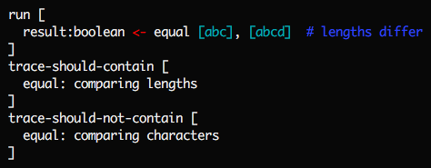
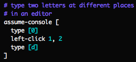
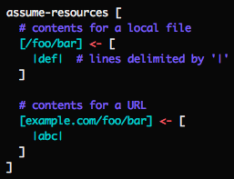
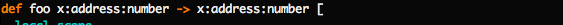

_by Stephen Malina and Kartik Agaram_

Mu explores ways to turn arbitrary manual tests into reproducible automated
tests. Hoped-for benefits:

1. Projects release with confidence without requiring manual QA or causing
   regressions for their users.

1. Open source projects become easier for outsiders to comprehend, since they
   can more confidently try out changes with the knowledge that they'll get
   rapid feedback if they break something. Projects also become more
   *rewrite-friendly* for insiders: it's easier to leave your project's
   historical accidents and other baggage behind if you can be confident of
   not causing regressions.

1. It becomes easier to teach programming by emphasizing tests far earlier
   than we do today.

The hypothesis is that designing the entire system to be testable from day 1
and from the ground up would radically impact the culture of an eco-system in
a way that no bolted-on tool or service at higher levels can replicate. It
would make it easier to write programs that can be [easily understood by newcomers](http://akkartik.name/about).
It would reassure authors that an app is free from regression if all automated
tests pass. It would make the stack easy to rewrite and simplify by dropping
features, without fear that a subset of targeted apps might break. As a result
people might fork projects more easily, and also exchange code between
disparate forks more easily (copy the tests over, then try copying code over
and making tests pass, rewriting and polishing where necessary). The community
would have in effect a diversified portfolio of forks, a “wavefront” of
possible combinations of features and alternative implementations of features
instead of the single trunk with monotonically growing complexity that we get
today. Application writers who wrote thorough tests for their apps (something
they just can’t do today) would be able to bounce around between forks more
easily without getting locked in to a single one as currently happens.

In this quest, Mu is currently experimenting with the following mechanisms:

1. New, testable interfaces for the operating system. Currently manual tests
   are hard to automate because a file you rely on might be deleted, the
   network might go down, etc. To make manual tests reproducible it suffices
   to improve the 15 or so OS syscalls through which a computer talks to the
   outside world. We have to allow programs to transparently write to a fake
   screen, read from a fake disk/network, etc. In Mu, printing to screen
   explicitly takes a screen object, so it can be called on the real screen,
   or on a fake screen inside tests, so that we can then check the expected
   state of the screen at the end of a test. Here's a test for a little
   text-mode chessboard program in Mu (delimiting the edge of the 'screen'
   with dots):

   &nbsp;&nbsp;&nbsp;&nbsp;&nbsp;&nbsp;

   We've built up similarly *dependency-injected* interfaces to the keyboard,
   mouse, disk and network.

1. Support for testing side-effects like performance, deadlock-freedom,
   race-freeness, memory usage, etc. Mu's *white-box tests* can check not just
   the results of a function call, but also the presence or absence of
   specific events in the log of its progress. For example, here's a test that
   our string-comparison function doesn't scan individual characters unless it
   has to:

   &nbsp;&nbsp;&nbsp;&nbsp;&nbsp;&nbsp;

   Another example: if a sort function logs each swap, a performance test can
   ensure that the number of swaps doesn't quadruple when the size of the
   input doubles.

   Besides expanding the scope of tests, this ability also allows more
   radical refactoring without needing to modify tests. All Mu's tests call a
   top-level function rather than individual sub-systems directly. As a result
   the way the subsystems are invoked can be radically changed (interface
   changes, making synchronous functions asynchronous, etc.). As long as the
   new versions emit the same implementation-independent events in the logs,
   the tests will continue to pass. ([More information.](http://akkartik.name/post/tracing-tests))

1. Organizing code and tests in layers of functionality, so that outsiders can
   build simple and successively more complex versions of a project, gradually
   enabling more peripheral features. Think of it as a cleaned-up `git log`
   for the project. ([More information.](http://akkartik.name/post/wart-layers))

These mechanisms exist in the context of a low-level statement-oriented
language (like Basic, or Assembly). The language is as powerful as C for
low-level pointer operations and manual memory management, but much safer,
paying some run-time overhead to validate pointers. It also provides a number
of features usually associated with higher-level languages: strong
type-safety, function overloading, lexical scope, generic functions,
higher-order functions, and [delimited continuations](http://akkartik.name/coroutines-in-mu).

Mu is currently interpreted and too slow for graphics or sound. We're
actively investigating ways to speed it up. In the meantime, Kartik uses it to
teach programming 1-on-1 with the motto, "teach testing before syntax."

*Taking Mu for a spin*

Mu is currently implemented in C++ and requires a Unix-like environment. It's
been tested on Ubuntu, Mac OS X and OpenBSD; on x86, x86\_64 and ARMv7; and on
recent versions of GCC and Clang. Since it uses no bleeding-edge language
features and has no exotic dependencies, it should work with most reasonable
versions, compilers or processors.

[](https://travis-ci.org/akkartik/mu)

Running Mu will always (re)compile it if necessary:

  ```shell
  $ cd mu
  $ ./mu
  ```

As a simple example, here's a program with some arithmetic:


Mu functions are lists of instructions, one to a line. Each instruction
operates on some *ingredients* and returns some *products*.

  ```
  [products] <- instruction [ingredients]
  ```

Result and ingredient *reagents* cannot contain instructions or infix
expressions. On the other hand, you can have any number of them. In
particular, you can have any number of products. For example, you can perform
integer division as follows:

  ```
  quotient:number, remainder:number <- divide-with-remainder 11, 3
  ```

Each reagent consists of a name and its type, separated by a colon. You only
have to specify the type the first time you mention a name, but you can be
more explicit if you choose. Types can be multiple words and even arbitrary
trees, like:

  ```nim
  x:array:number:3  # x is an array of 3 numbers
  y:list:number  # y is a list of numbers
  # ':' is just syntactic sugar
  {z: (map (address array character) (list number))}   # map from string to list of numbers
  ```

Try out the program now:

  ```shell
  $ ./mu example1.mu
  $
  ```

Not much to see yet, since it doesn't print anything. To print the result, try
adding the instruction `$print a` to the function.

---

Here's a second example, of a function that can take ingredients:


Functions can specify headers showing their expected ingredients and products,
separated by `->` (unlike the `<-` in calls).

Once defined, functions can be called just like primitives. No need to mess
with a `CALL` instruction or push/pop arguments to the stack.

Since Mu is a low-level VM language, it provides extra control at the cost of
verbosity. Using `local-scope`, you have explicit control over stack frames to
isolate your functions in a type-safe manner. You can also create more
sophisticated setups like closures. One consequence of this extra control: you
have to explicitly `load-ingredients` after you set up the stack.

An alternative syntax is what the above example is converted to internally:


The header gets dropped after checking types at call-sites, and after
replacing `load-ingredients` with explicit instructions to load each
ingredient separately, and to explicitly return products to the caller. After
this translation functions are once again just lists of instructions.

This alternative syntax isn't just an implementation detail. It turns out to
be easier to teach functions to non-programmers by starting with this syntax,
so that they can visualize a pipe from caller to callee, and see the names of
variables get translated one by one through the pipe.

---

A third example, this time illustrating conditionals:


In spite of how it looks, this is still just a list of instructions and
labels. Internally, the instructions `break` and `loop` get converted to
`jump` instructions to after the enclosing `}` or `{` labels, respectively.

Try out the factorial program now:

  ```shell
  $ ./mu factorial.mu
  result: 120  # factorial of 5
  ```

You can also run its unit tests:

  ```shell
  $ ./mu test factorial.mu
  ```

Here's what one of the tests inside `factorial.mu` looks like:


Every test conceptually spins up a really lightweight virtual machine, so you
can do things like check the value of specific locations in memory. You can
also print to screen and check that the screen contains what you expect at the
end of a test. For example, you've seen earlier how `chessboard.mu` checks the
initial position of a game of chess (delimiting the edges of the screen with
dots):


Similarly you can fake the keyboard to pretend someone typed something:


..or clicked somewhere:



Within tests you can map arbitrary paths (local files or URLs) to contents:



As we add graphics, audio, and so on, we'll augment scenarios with
corresponding abilities.

---

Mu assumes that all ingredients passed in to functions are immutable by
default -- *unless* they are also products. So this program will throw an
error:


To modify `foo`'s ingredient, you have to add it to the list of products
returned:



The names of the variables are important here: a function that takes an
(immutable) address and returns a different one is different from a function
that takes a mutable address (and also returns it).

These immutability checks can be annoying, but the benefit they provide is
that you can always tell what a function modifies just by looking at its
header. In combination with dependency-injected hardware, they provide all the
benefits of [referential transparency](https://en.wikipedia.org/wiki/Referential_transparency)
that we typically associate with purely functional languages -- along with the
option of imperatively modifying variables willy-nilly.

---

You can append arbitrary properties to reagents besides types and spaces. Just
separate them with slashes.

  ```nim
  x:array:number:3/uninitialized
  y:string/tainted:yes
  z:number/assign-once:true/assigned:false
  ```

Most properties are meaningless to Mu, and it'll silently skip them when
running, but they are fodder for *meta-programs* to check or modify your
programs, a task other languages typically hide from their programmers. For
example, where other programmers are restricted to the checks their type
system permits and forces them to use, you'll learn to create new checks that
make sense for your specific program. If it makes sense to perform different
checks in different parts of your program, you'll be able to do that.

You can imagine each reagent as a table, rows separated by slashes, columns
within a row separated by colons. So the last example above would become
something like this:

  ```
  z           : integer  /
  assign-once : true     /
  assigned    : false
  ```

---

An alternative way to define factorial is by inserting labels and later
inserting code at them.


(You'll find this version in `tangle.mu`.)

By convention we use the prefix '+' to indicate function-local label names you
can jump to, and surround in '<>' global label names for inserting code at.

---

Another example, this time with concurrency:


  ```shell
  $ ./mu fork.mu
  ```

Notice that it repeatedly prints either '34' or '35' at random. Hit ctrl-c to
stop.

[Yet another example](http://akkartik.github.io/mu/html/channel.mu.html) forks
two 'routines' that communicate over a channel:

  ```shell
  $ ./mu channel.mu
  produce: 0
  produce: 1
  produce: 2
  produce: 3
  consume: 0
  consume: 1
  consume: 2
  produce: 4
  consume: 3
  consume: 4

  # The exact order above might shift over time, but you'll never see a number
  # consumed before it's produced.
  ```

Channels are the unit of synchronization in Mu. Blocking on a channel is the
only way for the OS to put a task to sleep. The plan is to do all I/O over
channels.

Routines are expected to communicate purely by message passing, though nothing
stops them from sharing memory since all routines share a common address
space. However, idiomatic Mu will make it hard to accidentally read or clobber
random memory locations. Bounds checking is baked deeply into the semantics,
and pointers can never be invalidated.

---

Mu has a programming environment:

  ```shell
  $ ./mu edit
  ```

Screenshot:


You write functions on the left and try them out in *sandboxes* on the right.
Hit F4 to rerun all sandboxes with the latest version of the code. More
details: http://akkartik.name/post/mu. Beware, it won't save your edits by
default. But if you create a sub-directory called `lesson/` under `mu/` it
will. If you turn that directory into a git repo with `git init`, it will also
back up your changes each time you hit F4. Use the provided `new_lesson`
script to take care of these details.

Once you have a sandbox you can click on its result to mark it as expected:


Later if the result changes it'll be flagged in red to draw your attention to
it. Thus, manually tested sandboxes become reproducible automated tests.


Another feature: Clicking on the code in a sandbox expands its trace for you
to browse. To add to the trace, use `stash`. For example:

  ```nim
  stash [first ingredient is], x
  ```

Invaluable at times for understanding program behavior, but it won't clutter
up your screen by default.

---

If you're still reading, here are some more things to check out:

a) Look at the [chessboard program](http://akkartik.github.io/mu/html/chessboard.mu.html)
for a more complex example with tests of blocking reads from the keyboard and
what gets printed to the screen -- things we don't typically associate with
automated tests.

b) Try skimming the [colorized source code](https://akkartik.github.io/mu).
You should be able to get a pretty good sense for how things work just by
skimming the files in order, skimming the top of each file and ignoring
details lower down.

c) Try running the tests:

  ```shell
  $ ./mu test
  ```

d) Check out [the programming environment](https://github.com/akkartik/mu/tree/master/edit#readme),
the largest app built so far in Mu.

e) Look at the `build` scripts. Mu's compilation process is itself designed to
support staged learning. Each of the scripts (`build0`, `build1`, `build2`,
etc.) is self-contained and can compile the project by itself. Successive
versions add new features and configurability -- and complexity -- to the
compilation process.

**Credits**

Mu builds on many ideas that have come before, especially:

- [Peter Naur](http://alistair.cockburn.us/ASD+book+extract%3A+%22Naur,+Ehn,+Musashi%22)
  for articulating the paramount problem of programming: communicating a
  codebase to others;
- [Christopher Alexander](http://www.amazon.com/Notes-Synthesis-Form-Harvard-Paperbacks/dp/0674627512)
  and [Richard Gabriel](http://dreamsongs.net/Files/PatternsOfSoftware.pdf) for
  the intellectual tools for reasoning about the higher order design of a
  codebase;
- Unix and C for showing us how to co-evolve language and OS, and for teaching
  the (much maligned, misunderstood and underestimated) value of concise
  *implementation* in addition to a clean interface;
- Donald Knuth's [literate programming](http://www.literateprogramming.com/knuthweb.pdf)
  for liberating "code for humans to read" from the tyranny of compiler order;
- [David Parnas](http://www.cs.umd.edu/class/spring2003/cmsc838p/Design/criteria.pdf)
  and others for highlighting the value of separating concerns and stepwise
  refinement;
- [Lisp](http://www.paulgraham.com/rootsoflisp.html) for showing the power of
  dynamic languages, late binding and providing the right primitives *a la
  carte*, especially lisp macros;
- The folklore of debugging by print and the trace facility in many lisp
  systems;
- Automated tests for showing the value of developing programs inside an
  elaborate harness;
- [Python doctest](http://docs.python.org/2/library/doctest.html) for
  exemplifying interactive documentation that doubles as tests;
- [ReStructuredText](https://en.wikipedia.org/wiki/ReStructuredText)
  and [its antecedents](https://en.wikipedia.org/wiki/Setext) for showing that
  markup can be clean;
- BDD for challenging us all to write tests at a higher level;
- JavaScript and CSS for demonstrating the power of a DOM for complex
  structured documents.
- Rust for demonstrating that a system-programming language can be safe.
