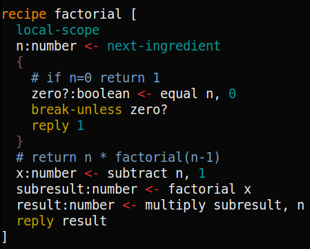

**Mu: making programs easier to understand in the large**

Mu explores an unconventional hypothesis: that all the ills of software
directly or indirectly stem from a single historical accident -- automatic
tests became mainstream *after* operating systems and high-level languages. As
a result the foundations of modern software have fatal flaws that very smart
people have tried heroically and unsuccessfully to fix at higher levels. Mu
attempts to undo this historical accident by recreating a software stack from
the ground up with testable interfaces. Unlike prior attempts, the goal isn't
to create a perfectly designed programming language and operating system (I'm
not smart enough). Rather, the goal is to preserve optionality, to avoid ever
committing to a design decision, so that any new lessons yielded by experience
are always able to rework all aspects of the design. The goal is to learn to
make software *rewrite-friendly* by giving up on backwards compatibility.

*The fundamental problem of software*

We programmers love to chase after silver bullets, to argue the pros and cons
of different programming languages and tools and methodologies, of whether
rewrites are a good idea or not. When I see smart and reasonable people
disagreeing on these questions I often track their difference down to
variations in personal experience. In particular, people with good experiences
of X seem disproportionately to have tried to use X at a smaller scale or
earlier in a project's life than people with bad experiences with X. I surmise
that this difference explains the lion's share of the benefits and drawbacks
people observe. It doesn't matter what programming language you use, whether
you program functionally or not, whether you follow an Object-Oriented
methodology or go Agile, whether you use shared memory or the Actor model.
What matters is whether you did this when the project was relatively early in
its life; how many man-hours had been spent on it already before your
alteration; how many people had contributed and then lost interest and moved
on, taking some hard-won unique knowledge of the system and its users out the
door with them. All projects decay over time and get slower to change with
age, and it's not because of some unavoidable increase in entropy. It's
because they grow monotonically more complex over time, because they are
gradually boxed in by compatibility guarantees, and because their increased
complexity makes them harder and harder for new team members to understand,
team members who inevitably take over when the original authors inevitably
move on.

If I'm right about all this, one guiding principle shines above all others:
keep projects easy for outsiders to navigate. It should be orders of magnitude
easier than it is today for a reasonably competent programmer to get your code
up and running, identify the start of the program, figure out what the major
sub-systems are and where they connect up, run parts of your program and
observe them in action in different situations with different inputs. All this
should require zero hand-holding by another human, and it should require very
little effort spent tracing through program logic. We all have the ability to
laboriously think through what a function does, but none of us is motivated to
do this for some strange program we've just encountered. And encountering a
strange program is the first step for someone on the long road to becoming a
regular contributor to your project. Make things dead simple for them. If they
make a change, make it dead simple for them to see if it breaks something.

(All this takes extra effort, and it isn't worth doing for throwaway
prototypes, but the effort pays dividends in situations where unit tests and
other best practices pay dividends.)

But this is a hard property for a codebase to start out with, even harder to
preserve, and impossible to regain once lost. It is a truth universally
acknowledged that the lucid clarity of initial versions of a program is
quickly and inevitably lost. The culprit here is monotonically growing
complexity that makes it impossible to tell when some aspect of the program
grows irrelevant and can be taken out. If you can't easily take something out,
you'll never do so because there'll always be more urgent things you could be
doing.

A big source of complexity creep is a project's interface to external users,
because you can't know all the ways in which users use a service. Historically
we react to this constraint by assuming that our users can do anything that we
ever allowed them to do in the past, and require ourselves to support all such
features. We can only add features, not drop them or change how we provide
them. We might, if we're forward thinking, keep our interfaces unstable for a
time. But the goal is usually to stabilize the interface, and inevitably the
stabilization is *premature*, because you can't anticipate what the future
holds. Stable interfaces inevitably get bolted-on features, grow complex and
breed a new generation of unsatisfied users who then attempt to wrap them in
sane interfaces, freeze *those* interfaces, start bolting on features to them,
rise and repeat. This dynamic of interfaces wrapping other interfaces is how
unix cat grows from a screenful of code in the original unix to
<a href='http://landley.net/aboriginal/history.html'>800 lines</a> in 2002 to
36 *thousand* lines of code in 2013.

To summarize, the arc you want to avoid is: you make backwards compatibility
guarantees &rarr; complexity creeps monotonically upward &rarr; funnel of
newcomer contributions slows &rarr; conversion of newcomers to insiders stalls
&rarr; knowledge of the system and its rationales gradually evaporates &rarr;
rate of change slows.

But what should we replace this arc with? It's hard to imagine how a world
could work without the division of labor that necessitates compatibility
guarantees. Here's my tentative proposal: when you build libraries or
interfaces for programmers, tell your users to write tests. Tell your users
that you reserve the right to change your interface in arbitrarily subtle
ways, and that in spite of any notifications over mailing lists and so on, the
only situation in which it will be safe to upgrade your library is if they've
written enough tests to cover all the edge cases of their domain that they
care about. "It doesn't exist if you haven't written a test for it."

But that's hard today because nobody's tests are that good. You can tell that
this is true, because even the best projects with tons of tests routinely
require manual QA when releasing a new version. A newcomer who's just starting
to hack on your project can't do that manual QA, so he doesn't know if this
line of code in your program is written *just so* because of some arcane
reason of performance or just because that was the first phrasing that came to
mind. The nice experience for an outsider would be to just change that line
and see if any tests fail. This is only possible if we eliminate all manual QA
from our release process.

*Therefore&hellip;*

In Mu, it will be possible for any aspect of any program that you can manually
test to also be turned into a reproducible automatic test. This may seem like
a tall order, and it is when you try to do it in a high-level language or <a
href='http://www.seleniumhq.org'>on top of a web browser</a>. If you drop down
to the lowest levels of your system's software, however, you find that it
really only interacts with the outside world over a handful of modalities. The
screen, the keyboard, the mouse, the disk, the network, maybe a couple more
that I haven't thought of yet. All Mu has to do is make these interfaces to
the outside world testable, give us the ability to record what we receive
through them and replay our recordings in tests.

Imagine a world where you can:

1. think of a tiny improvement to a program you use, clone its sources,
orient yourself on its organization and make your tiny improvement, all in a
single afternoon.

2. Record your program as it runs, and easily convert arbitrary logs of runs
into reproducible automatic tests.

3. Answer arbitrary what-if questions about a codebase by trying out changes
and seeing what tests fail, confident that *every* scenario previous authors
have considered has been encoded as a test.

4. Run first simple and successively more complex versions to stage your
learning.

I think all these abilities might be strongly correlated; the right testable
OS interfaces make them all achieveable. What's more, I can't see any way to
attain some of these abilities without the others.

As a concrete example, Unix lets you open a file by calling `open()` and
giving it a filename. But it implicitly modifies the file system, which means
that you can't easily call it from a test. In Mu, the `open()` syscall would
take a file system object as an explicit argument. You'd then be able to
access the real file system or fake it out inside a test. I'm adding similar
explicit arguments to handle the keyboard, the network, and so on. (This
process is called *dependency injection* and considered good practice in
modern application software. Why shouldn't our system software evolve to
benefit from it as well?)

**Brass tacks**

As you might surmise, this is a lot of work. To reduce my workload and get to
a proof-of-concept quickly, this is a very *alien* software stack. I've stolen
ideas from lots of previous systems, but it's not like anything you're used
to. The 'OS' will lack virtual memory, user accounts, any unprivileged mode,
address space isolation, and many other features.

To avoid building a compiler I'm going to do all my programming in (extremely
type-safe) assembly (for an idealized virtual machine that nonetheless is
designed to translate easily to real processors). To keep assembly from
getting too painful I'm going to pervasively use one trick: load-time
directives to let me order code however I want, and to write boilerplate once
and insert it in multiple places. If you're familiar with literate programming
or aspect-oriented programming, these directives may seem vaguely familiar. If
you're not, think of them as a richer interface for function inlining. (More
details: http://akkartik.name/post/wart-layers)

It probably makes you sad to have to give up the notational convenience of
modern high-level languages. I had to go through the five stages of grief
myself. But the benefits of the right foundation were eventually too
compelling to resist. If I turn out to be on the right track Mu will
eventually get high-level languages and more familiar mechanisms across the
board. And in the meantime, I'm actually seeing signs that syntax doesn't
really matter all that much when the goal is to understand global structure. A
recent, more speculative hypothesis of mine is that syntax is useful for
people who already understand the global structure of a program and who need
to repetitively perform tasks. But if you are a newcomer to a project and you
have a tiny peephole into it (your screen), no amount of syntactic compression
is going to get the big picture on your screen all at once. Instead you have
to pan around and reconstruct the big picture laboriously in your head. Tests
help, as I've described above. Another thing that helps is a zoomable
interface to the *trace* of operations performed in the course of a test (More
details: http://akkartik.name/post/tracing-tests)

High-level languages provide three things:

a) Expressiveness (nested expressions, function calls, etc.)

b) Safety (type checking, warnings, etc.)

c) Automation (garbage collection, a scheduler for green threads, etc.)

Mu ignores a) for a time, but there's no reason it can't provide b) and c), as
you'll see below.

*Taking Mu for a spin*

Mu is currently implemented in C++ and requires a unix-like environment. It's
been tested on ubuntu 14.04 on x86, x86\_64 and ARMv7 with recent versions of
gcc and clang. Since it uses no recent language features and has no exotic
dependencies, it should work with most reasonable versions, compilers or
processors.

Running Mu will always recompile it if necessary:

  ```shell
  $ cd mu
  $ ./mu
  ```

As a sneak peek, here's how you perform some simple arithmetic:

  ```nim
  def example1 [
    a:number <- add 2, 2
    a <- multiply a, 3
  ]
  ```

But it's easier to read in color:


Mu functions are lists of instructions, one to a line. Each instruction
operates on some *ingredients* and returns some *products*.

  ```
  [products] <- instruction [ingredients]
  ```

Result and ingredient *reagents* have to be variables. But you can have any
number of them. In particular you can have any number of products. For example,
you can perform integer division as follows:

  ```
  quotient:number, remainder:number <- divide-with-remainder 11, 3
  ```

Each reagent can provide a name as well as its type separated by a colon. You
only have to specify the type the first time you mention a name, but you can
be more explicit if you choose. Types can be multiple words and even arbitrary
trees, like:

  ```nim
  x:array:number:3  # x is an array of 3 numbers
  y:list:number  # y is a list of numbers
  # without syntactic sugar
  {z: (map (address array character) (list number))}   # map from string to list of numbers
  ```

Try out the program now:

  ```shell
  $ ./mu example1.mu
  $
  ```

Not much to see yet, since it doesn't print anything. To print the result, try
adding the instruction `$print a` to the function.

---

Here's a second example, of a function that can take ingredients:


Functions can specify headers showing their expected ingredients and products,
separated by `->` (unlike the `<-` in *calls*).

Since Mu is a low-level VM language, it provides extra control at the cost of
verbosity. Using `local-scope`, you have explicit control over stack frames to
isolate your functions (in a type-safe manner; more on that below). One
consequence: you have to explicitly `load-ingredients` after you set up the
stack.

An alternative syntax is what the above example is converted to internally:


The header gets dropped after checking types at call-sites, and after
replacing `load-ingredients` with explicit instructions to load each
ingredient separately, and to explicitly return products to the caller. After
this translation functions are once again just lists of instructions.

This alternative syntax isn't just an implementation detail. I've actually
found it easier to teach functions to non-programmers by starting with this
syntax, so that they can visualize a pipe from caller to callee, and see the
names of variables gradually get translated through the pipe.

---

A third example, this time illustrating conditionals:



In spite of how it looks, this is still just a list of instructions.
Internally, the instructions `break` and `loop` get converted to `jump`
instructions to after the enclosing `}` or `{`, respectively.

Try out the factorial program now:

  ```shell
  $ ./mu factorial.mu
  result: 120  # factorial of 5
  ```

You can also run its unit tests:

  ```shell
  $ ./mu test factorial.mu
  ```

Here's what one of the tests inside `factorial.mu` looks like:


Every test conceptually spins up a really lightweight virtual machine, so you
can do things like check the value of specific locations in memory. You can
also print to screen and check that the screen contains what you expect at the
end of a test. For example, `chessboard.mu` checks the initial position of a
game of chess (delimiting the edges of the screen with periods):


Similarly you can fake the keyboard to pretend someone typed something:

  ```
  assume-keyboard [a2-a4]
  ```

As we add a file system, graphics, audio, network support and so on, we'll
augment scenarios with corresponding abilities to use them inside tests.

---

The name of a reagent is for humans, but what the computer needs to access it is
its address. Mu maps names to addresses for you like in other languages, but
in a more transparent, lightweight, hackable manner. This instruction:

  ```nim
  z:number <- add x:number, y:number
  ```

might turn into this:

  ```nim
  3:number <- add 1:number, 2:number
  ```

You shouldn't rely on the specific address Mu chooses for a variable, but it
will be unique (other variables won't clobber it) and consistent (all mentions
of the name will map to the same address inside a function).

Things get more complicated when your functions call other functions. Mu
doesn't preserve uniqueness of addresses across functions, so you need to
organize your names into spaces. At the start of each function (like
`factorial` above), set its *default space*:

  ```nim
  local-scope
  ```

or

  ```nim
  new-default-space
  ```

or

  ```nim
  default-space:address:array:location <- new location:type, 30/capacity
  ```

Without one of these lines, all variables in the function will be *global*,
something you rarely want. (Luckily, this is also the sort of mistake that
will be easily caught by tests.) *With* this line, all addresses in your
function will by default refer to one of the (30, in the final case) slots
inside this local space. (If you choose the last, most explicit option and
need more than 30 slots, Mu will complain asking you to increase capacity.)

Spaces can do more than just implement local variables. You can string them
together, pass them around, return them from functions, share them between
parallel routines, and much else. However, any function receiving a space has
to know the names and types of variables in it, so any instruction should
always receive spaces created by the same function, no matter how many times
it's run. (If you're familiar with lexical scope, this constraint is
identical to it.)

To string two spaces together, write one into slot 0 of the other. This
instruction chains a space received from its caller:

  ```nim
  0:address:array:location <- next-ingredient
  ```

Once you've chained spaces together, you can access variables in them by
adding a 'space' property:

  ```nim
  3:number/space:1
  ```

This reagent is the number in slot 3 of the space chained in slot 0 of the
default space. We usually call it slot 3 in the 'next space'. `/space:2` would
be the next space of the next space, and so on.

See `counters.mu` for an example of managing multiple accumulators at once
without allowing them to clobber each other. This is a classic example of the
sorts of things closures and objects are useful for in other languages. Spaces
in Mu provide the same functionality.

---

You can append arbitrary properties to reagents besides types and spaces. Just
separate them with slashes.

  ```nim
  x:array:number:3/uninitialized
  y:string/tainted:yes
  z:list:number/assign-once:true/assigned:false
  ```

Most properties are meaningless to Mu, and it'll silently skip them when
running, but they are fodder for *meta-programs* to check or modify your
programs, a task other languages typically hide from their programmers. For
example, where other programmers are restricted to the checks their type
system permits and forces them to use, you'll learn to create new checks that
make sense for your specific program. If it makes sense to perform different
checks in different parts of your program, you'll be able to do that.

You can imagine each reagent as a table, rows separated by slashes, columns
within a row separated by colons. So the last example above would become
something like this:

  ```
  z           : list   : integer  /
  assign-once : true              /
  assigned    : false
  ```

---

An alternative way to define factorial is by inserting *labels* and later
inserting code at them.


(You'll find this version in `tangle.mu`.)

Any instruction without ingredients or products that starts with a
non-alphanumeric character is a label. By convention we use '+' to indicate
function-local label names you can jump to, and surround in '<>' global label
names for inserting code at.

---

Another example, this time with concurrency.


  ```shell
  $ ./mu fork.mu
  ```

Notice that it repeatedly prints either '34' or '35' at random. Hit ctrl-c to
stop.

Yet another example forks two 'routines' that communicate over a channel:

  ```shell
  $ ./mu channel.mu
  produce: 0
  produce: 1
  produce: 2
  produce: 3
  consume: 0
  consume: 1
  consume: 2
  produce: 4
  consume: 3
  consume: 4

  # The exact order above might shift over time, but you'll never see a number
  # consumed before it's produced.
  ```

Channels are the unit of synchronization in Mu. Blocking on channels are the
only way tasks can sleep waiting for results. The plan is to do all I/O over
channels that wait for data to return.

Routines are expected to communicate purely by message passing, though nothing
stops them from sharing memory since all routines share a common address
space. However, idiomatic Mu will make it hard to accidentally read or clobber
random memory locations. Bounds checking is baked deeply into the semantics,
and pointer arithmetic will be mostly forbidden (except inside the memory
allocator and a few other places).

---

If you're still reading, here are some more things to check out:

a) Look at the [chessboard program](http://akkartik.github.io/mu/html/chessboard.mu.html)
for a more complex example where I write tests showing blocking reads from the
keyboard and what gets printed to the screen -- things we don't typically
associate with automated tests.

b) Try skimming the [colorized source code](http://akkartik.github.io/mu). I'd
like it to eventually be possible to get a pretty good sense for how things
work just by skimming the files in order, skimming the top of each file and
ignoring details lower down. Tell me how successful my efforts are.

c) Try running the tests:

  ```shell
  $ ./mu test
  ```

You might also want to peek in the `.traces` directory, which automatically
includes logs for each test showing you just how it ran on my machine. If Mu
eventually gets complex enough that you have trouble running examples, these
logs might help figure out if my system is somehow different from yours or if
I've just been insufficiently diligent and my documentation is out of date.

d) Try out the programming environment:

  ```shell
  $ ./mu test edit  # takes about 30s; shouldn't show any failures
  $ ./mu edit
  ```

Screenshot:


You write functions on the left and try them out in *sandboxes* on the right.
Hit F4 to rerun all sandboxes with the latest version of the code. More
details: http://akkartik.name/post/mu. Beware, it won't save your edits by
default. But if you create a sub-directory called `lesson/` under `mu/` it
will. If you turn that directory into a git repo with `git init`, it will also
back up each version you try out.

Once you have a sandbox you can click on its result to mark it as expected:


Later if the result changes it'll be flagged in red to draw your attention to
it. Thus, manually tested sandboxes become reproducible automated tests.


Another feature: Clicking on the code in a sandbox expands its trace for you
to browse. To add to the trace, use `stash`. For example:

  ```nim
  stash [first ingredient is ], x
  ```

Invaluable for understanding complex control flow without cluttering up the
screen.

The next major milestone on Mu's roadmap is dependency-injected interfaces for
the network and file system.

**Credits**

Mu builds on many ideas that have come before, especially:

- [Peter Naur](http://alistair.cockburn.us/ASD+book+extract%3A+%22Naur,+Ehn,+Musashi%22)
  for articulating the paramount problem of programming: communicating a
  codebase to others;
- [Christopher Alexander](http://www.amazon.com/Notes-Synthesis-Form-Harvard-Paperbacks/dp/0674627512)
  and [Richard Gabriel](http://dreamsongs.net/Files/PatternsOfSoftware.pdf) for
  the intellectual tools for reasoning about the higher order design of a
  codebase;
- Unix and C for showing us how to co-evolve language and OS, and for teaching
  the (much maligned, misunderstood and underestimated) value of concise
  *implementation* in addition to a clean interface;
- Donald Knuth's [literate programming](http://www.literateprogramming.com/knuthweb.pdf)
  for liberating "code for humans to read" from the tyranny of compiler order;
- [David Parnas](http://www.cs.umd.edu/class/spring2003/cmsc838p/Design/criteria.pdf)
  and others for highlighting the value of separating concerns and stepwise
  refinement;
- [Lisp](http://www.paulgraham.com/rootsoflisp.html) for showing the power of
  dynamic languages, late binding and providing the right primitives *a la
  carte*, especially lisp macros;
- The folklore of debugging by print and the trace facility in many lisp
  systems;
- Automated tests for showing the value of developing programs inside an
  elaborate harness;
- [Python doctest](http://docs.python.org/2/library/doctest.html) for
  exemplifying interactive documentation that doubles as tests;
- [ReStructuredText](https://en.wikipedia.org/wiki/ReStructuredText)
  and [its antecedents](https://en.wikipedia.org/wiki/Setext) for showing that
  markup can be clean;
- BDD for challenging us all to write tests at a higher level;
- JavaScript and CSS for demonstrating the power of a DOM for complex
  structured documents.
