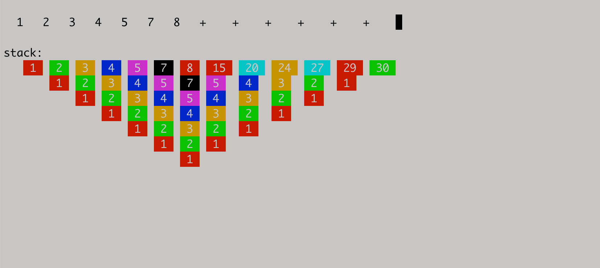

This directory contains Mu programs and infrastructure that require a Linux
kernel. To run programs under this directory, you must first `cd` into it.

  ```sh
  $ cd linux/
  $ ./translate hello.mu      # generates a.elf
  $ ./a.elf
  Hello world!
  ```

See the [shared vocabulary](vocabulary.md) of data types and functions shared
by Mu programs running on Linux. Mu programs can transparently call low-level
functions written in SubX.

Some programs to try out:

* `tile`: [An experimental live-updating postfix shell environment](https://mastodon.social/@akkartik/105108305362341204)
  that updates as you type. Prototype. Look at this to see what is currently
  possible, not how I recommend building software.

  

* `browse`: [A text-mode browser for a tiny subset of Markdown](https://mastodon.social/@akkartik/104845344081779025).

* `ex*`: small stand-alone examples that don't need any of the shared code at
  the top-level. They each have a simple pedagogical goal. Read these first.

* `factorial*`: A simple program to compute factorials in 5 versions, showing
  all the different syntax sugars and what they expand to.

The Mu compiler toolchain is also here in the following phases:

* Bare SubX: `hex`, `survey_elf`, `pack`, `dquotes`, `assort`, `tests`
* Syntax sugar for SubX: `sigils`, `calls`, `braces`
* Mu-&gt;SubX compiler: `mu`

The toolchain includes binaries in the repo. At any commit, the binary should
be identical bit for bit with the result of translating the corresponding
`.subx` file. The binary should also be natively runnable on a Linux system
running on Intel x86 processors, either 32- or 64-bit. If either of these
invariants is violated, it's a bug.
