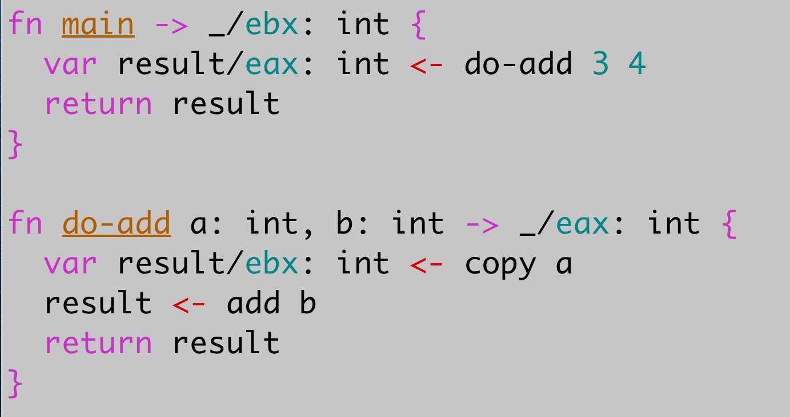

# Mu Syntax

Here are two valid statements in Mu:

```
increment x
y <- increment
```

Understanding when to use one vs the other is the critical idea in Mu. In
short, the former increments a value in memory, while the latter increments a
value in a register.

Most languages start from some syntax and do what it takes to implement it.
Mu, however, is designed as a safe way to program in [a regular subset of
32-bit x86 machine code](subx.md), _satisficing_ rather than optimizing for a
clean syntax. To keep the mapping to machine code lightweight, Mu exclusively
uses statements. Most statements map to a single instruction of machine code.

Since the x86 instruction set restricts how many memory locations an instruction
can use, Mu makes registers explicit as well. Variables must be explicitly
mapped to specific registers; otherwise they live in memory. While you have to
do your own register allocation, Mu will helpfully point out when you get it
wrong.

Statements consist of 3 parts: the operation, optional _inouts_ and optional
_outputs_. Outputs come before the operation name and `<-`.

Outputs are always registers; memory locations that need to be modified are
passed in by reference in inouts.

So Mu programmers need to make two new categories of decisions: whether to
define variables in registers or memory, and whether to put variables to the
left or right. There's always exactly one way to write any given operation. In
return for this overhead you get a lightweight and future-proof stack. And Mu
will provide good error messages to support you.

Further down, this page enumerates all available primitives in Mu, and [a
separate page](http://akkartik.github.io/mu/html/mu_instructions.html)
describes how each primitive is translated to machine code. There is also a
useful list of pre-defined functions (implemented in unsafe machine code) in [400.mu](http://akkartik.github.io/mu/html/400.mu.html)
and [vocabulary.md](vocabulary.md).

## Functions and calls

Zooming out from single statements, here's a complete sample program in Mu
that runs in Linux:



Mu programs are lists of functions. Each function has the following form:

```
fn _name_ _inout_ ... -> _output_ ... {
  _statement_
  _statement_
  ...
}
```

Each function has a header line, and some number of statements, each on a
separate line. Headers describe inouts and outputs. Inouts can't be registers,
and outputs _must_ be registers (specified using metadata after a `/`).
Outputs can't take names.

The above program also demonstrates a function call (to the function `do-add`).
Function calls look the same as primitive statements: they can return (multiple)
outputs in registers, and modify inouts passed in by reference. In addition,
there's one more constraint: output registers must match the function header.
For example:

```
fn f -> _/eax: int {
  ...
}
fn g {
  a/eax <- f  # ok
  a/ebx <- f  # wrong; `a` must be in register `eax`
}
```

You can exit a function at any time with the `return` instruction. Give it the
right number of arguments, and it'll assign them respectively to the function's
outputs before jumping back to the caller.

Mu encloses multi-word types in parentheses, and types can get quite expressive.
For example, you read `main`'s inout type as "an address to an array of
addresses to arrays of bytes." Since addresses to arrays of bytes are almost
always strings in Mu, you'll quickly learn to mentally shorten this type to
"an address to an array of strings".

Mu currently has no way to name magic constants. Instead, document integer
literals using metadata after a `/`. For example:

```
var x/eax: int <- copy 3/margin-left
```

Here we use metadata in two ways: to specify a register for the variable `x`
(checked), and to give a name to the constant `3` (unchecked; purely for
documentation).

Variables can't currently accept unchecked metadata for documentation.
(Perhaps this should change.)

The function `main` is special. It's where Mu programs start executing. It has
a different signature depending on whether a Mu program requires Linux or can
run without an OS. On Linux, the signature looks like this:

```
fn main args: (addr array addr array byte) -> _/ebx: int
```

It takes an array of strings and returns a status code to Linux in register
`ebx`.

Without an OS, the signature looks like this:

```
fn main screen: (addr screen), keyboard: (addr keyboard), data-disk: (addr disk)
```

A screen and keyboard are explicitly passed in. The goal is for all hardware
dependencies to always be explicit. However there are currently gaps:
  * The mouse is accessed implicitly
  * The screen argument only supports text-mode graphics. Pixel graphics rely
    on implicit access to the screen.
  * The Mu computer has two disks, and the disk containing Mu code is not
    accessible.

## Blocks

Blocks are useful for grouping related statements. They're delimited by `{`
and `}`, each alone on a line.

Blocks can nest:

```
{
  _statements_
  {
    _more statements_
  }
}
```

Blocks can be named (with the name ending in a `:` on the same line as the
`{`):

```
$name: {
  _statements_
}
```

Further down we'll see primitive statements for skipping or repeating blocks.
Besides control flow, the other use for blocks is...

## Local variables

Functions can define new variables at any time with the keyword `var`. There
are two variants of the `var` statement, for defining variables in registers
or memory.

```
var name: type
var name/reg: type <- ...
```

Variables on the stack are never initialized. (They're always implicitly
zeroed out.) Variables in registers are always initialized.

Register variables can go in 6 integer registers (`eax`, `ebx`, `ecx`, `edx`,
`esi`, `edi`) or 8 floating-point registers (`xmm0`, `xmm1`, `xmm2`, `xmm3`,
`xmm4`, `xmm5`, `xmm6`, `xmm7`).

Defining a variable in a register either clobbers the previous variable (if it
was defined in the same block) or shadows it temporarily (if it was defined in
an outer block).

Variables exist from their definition until the end of their containing block.
Register variables may also die earlier if their register is clobbered by a
new variable.

Variables on the stack can be of many types (but not `byte`). Integer registers
can only contain 32-bit values: `int`, `byte`, `boolean`, `(addr ...)`. Floating-point
registers can only contain values of type `float`.

## Integer primitives

Here is the list of arithmetic primitive operations supported by Mu. The name
`n` indicates a literal integer rather than a variable, and `var/reg` indicates
a variable in a register, though that's not always valid Mu syntax.

```
var/reg <- increment
increment var
var/reg <- decrement
decrement var
var1/reg1 <- add var2/reg2
var/reg <- add var2
add-to var1, var2/reg
var/reg <- add n
add-to var, n

var1/reg1 <- subtract var2/reg2
var/reg <- subtract var2
subtract-from var1, var2/reg
var/reg <- subtract n
subtract-from var, n

var1/reg1 <- xor var2/reg2
var/reg <- xor var2
xor-with var1, var2/reg
var/reg <- xor n
xor-with var, n

var1/reg1 <- negate
negate var

var/reg <- copy var2/reg2
copy-to var1, var2/reg
var/reg <- copy var2
var/reg <- copy n
copy-to var, n

compare var1, var2/reg
compare var1/reg, var2
compare var/eax, n
compare var, n

var/reg <- shift-left n
var/reg <- shift-right n
var/reg <- shift-right-signed n
shift-left var, n
shift-right var, n
shift-right-signed var, n

var/reg <- multiply var2
```

Bitwise operations:
```
var1/reg1 <- and var2/reg2
var/reg <- and var2
and-with var1, var2/reg
var/reg <- and n
and-with var, n

var1/reg1 <- or var2/reg2
var/reg <- or var2
or-with var1, var2/reg
var/reg <- or n
or-with var, n

var1/reg1 <- not
not var
```

Any statement above that takes a variable in memory can be replaced with a
dereference (`*`) of an address variable (of type `(addr ...)`) in a register.
You can't dereference variables in memory. You have to load them into a
register first.

Excluding dereferences, the above statements must operate on non-address
values with primitive types: `int`, `boolean` or `byte`. (Booleans are really
just `int`s, and Mu assumes any value but `0` is true.) You can copy addresses
to int variables, but not the other way around.

## Floating-point primitives

These instructions may use the floating-point registers `xmm0` ... `xmm7`
(denoted by `/xreg2` or `/xrm32`). They also use integer values on occasion
(`/rm32` and `/r32`).

```
var/xreg <- add var2/xreg2
var/xreg <- add var2
var/xreg <- add *var2/reg2

var/xreg <- subtract var2/xreg2
var/xreg <- subtract var2
var/xreg <- subtract *var2/reg2

var/xreg <- multiply var2/xreg2
var/xreg <- multiply var2
var/xreg <- multiply *var2/reg2

var/xreg <- divide var2/xreg2
var/xreg <- divide var2
var/xreg <- divide *var2/reg2

var/xreg <- reciprocal var2/xreg2
var/xreg <- reciprocal var2
var/xreg <- reciprocal *var2/reg2

var/xreg <- square-root var2/xreg2
var/xreg <- square-root var2
var/xreg <- square-root *var2/reg2

var/xreg <- inverse-square-root var2/xreg2
var/xreg <- inverse-square-root var2
var/xreg <- inverse-square-root *var2/reg2

var/xreg <- min var2/xreg2
var/xreg <- min var2
var/xreg <- min *var2/reg2

var/xreg <- max var2/xreg2
var/xreg <- max var2
var/xreg <- max *var2/reg2
```

Remember, when these instructions use indirect mode, they still use an integer
register. Floating-point registers can't hold addresses.

Two instructions in the above list are approximate. According to the Intel
manual, `reciprocal` and `inverse-square-root` [go off the rails around the
fourth decimal place](x86_approx.md). If you need more precision, use `divide`
separately.

Most instructions operate exclusively on integer or floating-point operands.
The only exceptions are the instructions for converting between integers and
floating-point numbers.

```
var/xreg <- convert var2/reg2
var/xreg <- convert var2
var/xreg <- convert *var2/reg2

var/reg <- convert var2/xreg2
var/reg <- convert var2
var/reg <- convert *var2/reg2

var/reg <- truncate var2/xreg2
var/reg <- truncate var2
var/reg <- truncate *var2/reg2
```

There are no instructions accepting floating-point literals. To obtain integer
literals in floating-point registers, copy them to general-purpose registers
and then convert them to floating-point.

The floating-point instructions above always write to registers. The only
instructions that can write floats to memory are `copy` instructions.

```
var/xreg <- copy var2/xreg2
copy-to var1, var2/xreg
var/xreg <- copy var2
var/xreg <- copy *var2/reg2
```

Finally, there are floating-point comparisons. They must always put a register
on the left-hand side:

```
compare var1/xreg1, var2/xreg2
compare var1/xreg1, var2
```

## Operating on individual bytes

A special case is variables of type `byte`. Mu is a 32-bit platform so for the
most part only supports types that are multiples of 32 bits. However, we do
want to support strings in ASCII and UTF-8, which will be arrays of 8-bit
bytes.

Since most x86 instructions implicitly load 32 bits at a time from memory,
variables of type 'byte' are only allowed in registers, not on the stack. Here
are the possible statements for reading bytes to/from memory:

```
var/reg <- copy-byte var2/reg2      # var: byte
var/reg <- copy-byte *var2/reg2     # var: byte
copy-byte-to *var1/reg1, var2/reg2  # var1: (addr byte)
```

In addition, variables of type 'byte' are restricted to (the lowest bytes of)
just 4 registers: `eax`, `ecx`, `edx` and `ebx`. As always, this is due to
constraints of the x86 instruction set.

## Primitive jumps

There are two kinds of jumps, both with many variations: `break` and `loop`.
`break` instructions jump to the end of the containing block. `loop` instructions
jump to the beginning of the containing block.

All jumps can take an optional label starting with '$':

```
loop $foo
```

This instruction jumps to the beginning of the block called $foo. The corresponding
`break` jumps to the end of the block. Either jump statement must lie somewhere
inside such a block. Jumps are only legal to containing blocks. (Use named
blocks with restraint; jumps to places far away can get confusing.)

There are two unconditional jumps:

```
loop
loop label
break
break label
```

The remaining jump instructions are all conditional. Conditional jumps rely on
the result of the most recently executed `compare` instruction. (To keep
programs easy to read, keep `compare` instructions close to the jump that uses
them.)

```
break-if-=
break-if-= label
break-if-!=
break-if-!= label
```

Inequalities are similar, but have additional variants for addresses and floats.

```
break-if-<
break-if-< label
break-if->
break-if-> label
break-if-<=
break-if-<= label
break-if->=
break-if->= label

break-if-addr<
break-if-addr< label
break-if-addr>
break-if-addr> label
break-if-addr<=
break-if-addr<= label
break-if-addr>=
break-if-addr>= label

break-if-float<
break-if-float< label
break-if-float>
break-if-float> label
break-if-float<=
break-if-float<= label
break-if-float>=
break-if-float>= label
```

Similarly, conditional loops:

```
loop-if-=
loop-if-= label
loop-if-!=
loop-if-!= label

loop-if-<
loop-if-< label
loop-if->
loop-if-> label
loop-if-<=
loop-if-<= label
loop-if->=
loop-if->= label

loop-if-addr<
loop-if-addr< label
loop-if-addr>
loop-if-addr> label
loop-if-addr<=
loop-if-addr<= label
loop-if-addr>=
loop-if-addr>= label

loop-if-float<
loop-if-float< label
loop-if-float>
loop-if-float> label
loop-if-float<=
loop-if-float<= label
loop-if-float>=
loop-if-float>= label
```

## Addresses

Passing objects by reference requires the `address` operation, which returns
an object of type `addr`.

```
var/reg: (addr T) <- address var2: T
```

Here `var2` can't live in a register.

## Array operations

Here's an example definition of a fixed-length array:

```
var x: (array int 3)
```

The length (here `3`) must be an integer literal. We'll show how to create
dynamically-sized arrays further down.

Arrays can be large; to avoid copying them around on every function call
you'll usually want to manage `addr`s to them. Here's an example computing the
address of an array.

```
var n/eax: (addr array int) <- address x
```

Addresses to arrays don't include the array length in their type. However, you
can obtain the length of an array like this:

```
var/reg: int <- length arr/reg: (addr array T)
```

To operate on elements of an array, use the `index` statement:

```
var/reg: (addr T) <- index arr/reg: (addr array T), n
var/reg: (addr T) <- index arr: (array T len), n
```

The index can also be a variable in a register, with a caveat:

```
var/reg: (addr T) <- index arr/reg: (addr array T), idx/reg: int
var/reg: (addr T) <- index arr: (array T len), idx/reg: int
```

The caveat: the size of T must be 1, 2, 4 or 8 bytes. The x86 instruction set
has complex addressing modes that can index into an array in a single instruction
in these situations.

For other sizes of T you'll need to split up the work, performing a `compute-offset`
before the `index`.

```
var/reg: (offset T) <- compute-offset arr: (addr array T), idx/reg: int     # arr can be in reg or mem
var/reg: (offset T) <- compute-offset arr: (addr array T), idx: int         # arr can be in reg or mem
```

The `compute-offset` statement returns a value of type `(offset T)` after
performing any necessary bounds checking. Now the offset can be passed to
`index` as usual:

```
var/reg: (addr T) <- index arr/reg: (addr array T), idx/reg: (offset T)
```

## Stream operations

A common use for arrays is as buffers. Save a few items to a scratch space and
then process them. This pattern is so common (we use it in files) that there's
special support for it with a built-in type: `stream`.

Streams are like arrays in many ways. You can initialize them with a length:

```
var x: (stream int 3)
```

However, streams don't provide random access with an `index` instruction.
Instead, you write to them sequentially, and read back what you wrote.

```
read-from-stream s: (addr stream T), out: (addr T)
write-to-stream s: (addr stream T), in: (addr T)
var/eax: boolean <- stream-empty? s: (addr stream)
var/eax: boolean <- stream-full? s: (addr stream)
```

You can clear streams:

```
clear-stream f: (addr stream _)
```

You can also rewind them to reread what's been written:

```
rewind-stream f: (addr stream _)
```

## Compound types

Primitive types can be combined together using the `type` keyword. For
example:

```
type point {
  x: int
  y: int
}
```

Mu programs are currently sequences of `fn` and `type` definitions.

Compound types can't include `addr` types for safety reasons (use `handle` instead,
which is described below). They also can't currently include `array`, `stream`
or `byte` types. Since arrays and streams carry their size with them, supporting
them in compound types complicates variable initialization. Instead of
defining them inline in a type definition, define a `handle` to them. Bytes
shouldn't be used for anything but utf-8 strings.

To access within a compound type, use the `get` instruction. There are two
forms. You need either a variable of the type itself (say `T`) in memory, or a
variable of type `(addr T)` in a register.

```
var/reg: (addr T_f) <- get var/reg: (addr T), f
var/reg: (addr T_f) <- get var: T, f
```

The `f` here is the field name from the `type` definition, and its type `T_f`
must match the type of `f` in the `type` definition. For example, some legal
instructions for the definition of `point` above:

```
var a/eax: (addr int) <- get p, x
var a/eax: (addr int) <- get p, y
```

You can clear arbitrary types using the `clear-object` function:

```
clear-object var: (addr T)
```

Don't clear arrays or streams using `clear-object`; doing so will irreversibly
make their length 0 as well.

You can shallow-copy arbitrary types using the `copy-object` function:

```
copy-object src: (addr T), dest: (addr T)
```

## Handles for safe access to the heap

We've seen the `addr` type, but it's intended to be short-lived. `addr` values
should never escape from functions. Function outputs can't be `addr`s,
function inouts can't include `addr` in their payload type. Finally, you can't
save `addr` values inside compound `type`s. To do that you need a "fat
pointer" called a `handle` that is safe to keep around for extended periods
and ensures it's used safely without corrupting the heap and causing security
issues or hard-to-debug misbehavior.

To actually _use_ a `handle`, we have to turn it into an `addr` first using
the `lookup` statement.

```
var y/reg: (addr T) <- lookup x: (handle T)
```

Now operate on `y` as usual, safe in the knowledge that you can later recover
any writes to its payload from `x`.

It's illegal to continue to use an `addr` after a function that reclaims heap
memory. You have to repeat the lookup from the `handle`. (Luckily Mu doesn't
implement reclamation yet.)

Having two kinds of addresses takes some getting used to. Do we pass in
variables by value, by `addr` or by `handle`? In inputs or outputs? Here are 3
rules of thumb:

  * Functions that need to look at the payload should accept an `(addr ...)`
    where possible.
  * Functions that need to treat a handle as a value, without looking at its
    payload, should accept a `(handle ...)`. Helpers that save handles into
    data structures are a common example.
  * Functions that need to allocate memory should accept an `(addr handle ...)`.

Try to avoid mixing these use cases.

If you have a variable `src` of type `(handle ...)`, you can save it inside a
compound type like this (provided the types match):

```
var dest/reg: (addr handle T_f) <- get var: (addr T), f
copy-handle src, dest
```

Or this:

```
var dest/reg: (addr handle T) <- index arr: (addr array handle T), n
copy-handle src, dest
```

To create handles to non-array types, use `allocate`:

```
var x: (addr handle T)
... initialize x ...
allocate x
```

To create handles to array types (of potentially dynamic size), use `populate`:

```
var x: (addr handle array T)
... initialize x ...
populate x, 3  # array of 3 T's
```

## Seams

I said at the start that most instructions map 1:1 to x86 machine code. To
enforce type- and memory-safety, I was forced to carve out a few exceptions:

* the `index` instruction on arrays, for bounds-checking
* the `length` instruction on arrays, for translating the array size in bytes
  into the number of elements.
* the `lookup` instruction on handles, for validating fat-pointer metadata
* `var` instructions, to initialize memory
* byte copies, to initialize memory

If you're curious, [the compiler summary page](http://akkartik.github.io/mu/html/mu_instructions.html)
has the complete nitty-gritty on how each instruction is implemented. Including
the above exceptions.

## Conclusion

Anything not allowed here is forbidden, even if the compiler doesn't currently
detect and complain about it. Please [contact me](mailto:ak@akkartik.com) or
[report issues](https://github.com/akkartik/mu/issues) when you encounter a
missing or misleading error message.
