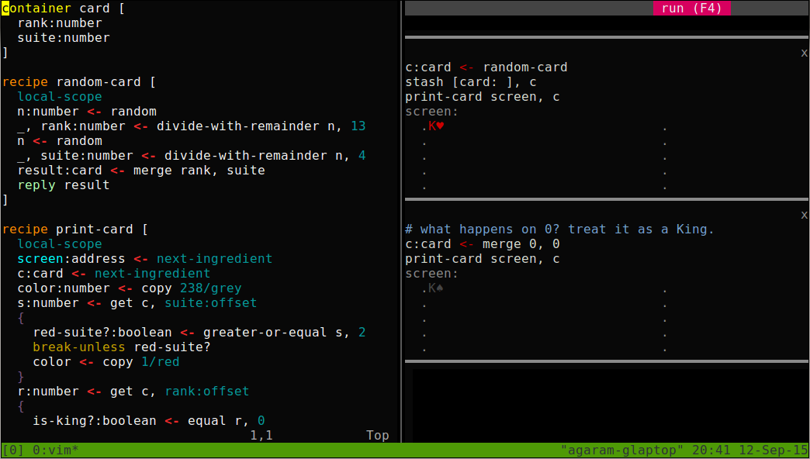

Variant of [the mu programming environment](../edit) that runs just the sandbox.

Suitable for people who want to run their favorite terminal-based editor with
mu. Just run editor and sandbox inside split panes atop tmux. For example,
here's mu running alongside vim:

To set this up:

  a) copy the lines in tmux.conf into `$HOME/.tmux.conf`.

  b) copy the file `mu_run` somewhere in your `$PATH`.

Now when you start tmux, split it into two vertical panes, run `mu sandbox` on
the right pane and your editor on the left. You should be able to hit F4 in
either side to run the sandbox.

Known issues: you have to explicitly save inside your editor before hitting
F4, unlike with `mu edit`.
