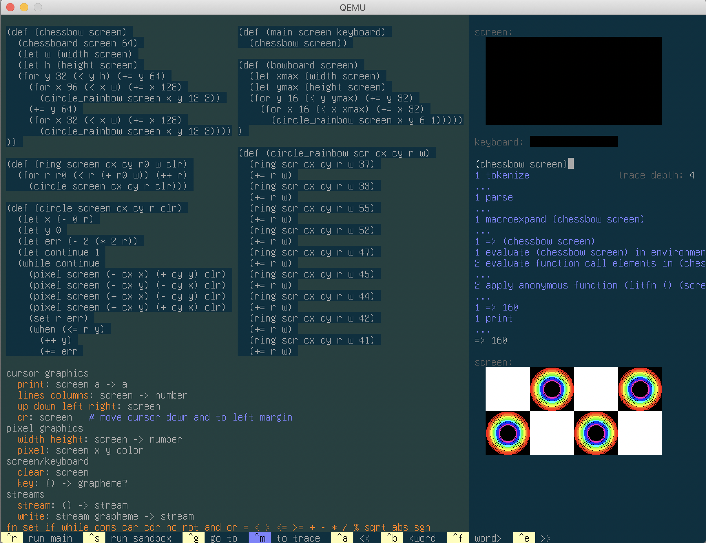

### A prototype shell for the Mu computer

Currently runs a tiny dialect of Lisp. Steps to run it from the top-level:

1. Build it:

  ```sh
  $ ./translate shell/*.mu      # generates code.img
  ```

  You can now already run it (under emulation):
  ```sh
  $ qemu-system-i386 code.img
  ```

  But let's add some more 'meat' to play with.

2. Create a data disk with a library of functions.

  ```sh
  $ dd if=/dev/zero of=data.img count=20160
  $ cat shell/data.limg |dd of=data.img conv=notrunc
  ```

  Run with data disk (and 2GB of RAM):
  ```sh
  $ qemu-system-i386 -m 2G -hda code.img -hdb data.img
  ```

  

  The Mu computer has a fixed-size screen, which the shell environment
  partitions into two major regions, with a context-sensitive menu of keyboard
  shortcuts along the bottom. (No mouse support at the moment.) On the left,
  two-thirds of the screen is for editing functions and viewing documentation
  on available primitives. On the right is a REPL where you can try out
  expressions and see their output. The REPL also has a little toy screen and
  keyboard for interactively playing with side effects of expressions.

  Try typing in some expressions at the REPL and hitting `ctrl-s` to see their
  results. Hit `ctrl-m` to focus on the `...` after a run, and browse how the
  _trace_ of how the results were computed. [Here's a 2-minute demo](https://archive.org/details/akkartik-mu-2021-05-31).

3. If your Qemu installation supports them, one of these commandline arguments
   may speed up emulation:

  - `-enable-kvm`
  - `-accel ___` (run with `-accel help` for a list of available options)

  If you do this, I recommend also adjusting the `responsiveness` mask in
  shell/evaluate.mu, which controls how frequently the fake screen updates.
  Smaller values will seem more responsive, larger values will leave more time
  to run your programs. I like to see the screen update about once a second.
  Some suggested values depending on how fast your Qemu is running:

  - `-enable-kvm` on a T420s running Linux: `0xffff/responsiveness=64k`
  - `-accel tcg` on a 2019 Mac: `0xfff/responsiveness=4k`

  Putting it all together, here's the command I typically use on Linux:

  ```
  $ qemu-system-i386 -m 2G -enable-kvm -hda code.img -hdb data.img
  ```

*Known issues*

* No mouse support.

* Don't press keys too quickly (such as by holding down a key). The Mu
  computer will crash (and often Qemu will segfault).

* Mu currently assumes access to 2GB of RAM. To increase that, modify the
  definition of `Heap` in 120allocate.subx, and then modify the `-m 2G`
  argument in the Qemu commands above. Mu currently has no virtual
  memory. If your Heap is too large for RAM, allocating past the end of RAM
  will succeed. However, accessing addresses not backed by RAM will fail with
  this error:

  ```
  lookup: failed
  ```
