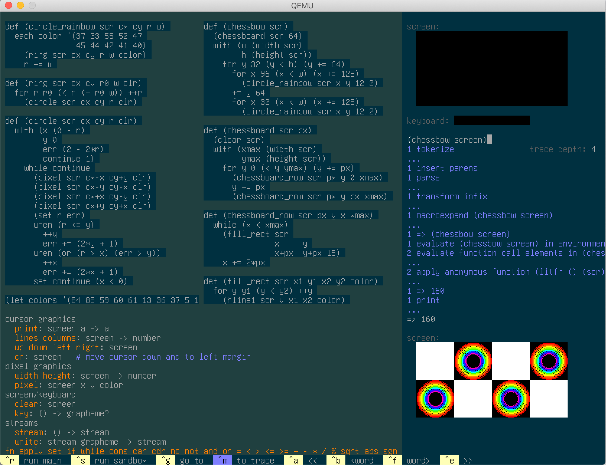

### A prototype shell for the Mu computer

Currently runs a tiny dialect of Lisp. Steps to run it from the top-level:

1. Build it:

  ```sh
  ./translate shell/*.mu      # generates code.img
  ```

  You can now already run it (under emulation):
  ```sh
  qemu-system-i386 code.img
  ```

  But let's add some more 'meat' to play with.

2. Create a data disk with a library of functions.

  ```sh
  dd if=/dev/zero of=data.img count=20160         # approximately 10MB
  dd if=shell/data.limg of=data.img conv=notrunc
  ```

  Equivalently, use `tools/image-data`.

  ```sh
  tools/image-data 10 < shell/data.limg
  ```

3. Run with data disk (and 2GB of RAM):
  ```sh
  qemu-system-i386 -m 2G -hda code.img -hdb data.img
  ```

  

  The Mu computer has a fixed-size screen, which the shell environment
  partitions into two major regions, with a context-sensitive menu of keyboard
  shortcuts along the bottom. (No mouse support at the moment.) On the left,
  two-thirds of the screen is for editing functions and viewing documentation
  on available primitives. On the right is a REPL where you can try out
  expressions and see their output. The REPL also has a little toy screen and
  keyboard for interactively playing with side effects of expressions.

  Try typing in some expressions at the REPL and hitting `ctrl-s` to see their
  results. Hit `ctrl-m` to focus on the `...` after a run, and browse how the
  _trace_ of how the results were computed. [Here's a 2-minute demo](https://archive.org/details/akkartik-mu-2021-05-31).

  To navigate to a function to edit, hit `ctrl-g`. The list of functions
  doubles as a bare-bones &ldquo;file system,&rdquo; and functions are
  rendered in order of most recently touched, like in [Tiddlywiki](https://tiddlywiki.com).
  There is no scrolling anywhere yet.

3. If your Qemu installation supports them, an `-accel` argument
   will speed up emulation. Try `-accel help` to list your options.

  Once you select an accelerator, I recommend also adjusting the `responsiveness`
  mask in shell/evaluate.mu, which controls how frequently the fake screen
  updates within the REPL. Smaller values will seem more responsive, larger
  values will run your programs faster. I like to see the fake screen update
  about once a second. Some suggested values depending on how fast your Qemu
  is running:

  - `-accel kvm` on a T420s running Linux: `0xffff/responsiveness=64k`
  - `-accel tcg` on a 2019 Mac: `0xfff/responsiveness=4k`

  Putting it all together, here's the command I typically use on Linux:

  ```
  qemu-system-i386 -m 2G -accel kvm -hda code.img -hdb data.img
  ```

### Indent-sensitivity

The Mu shell is a Lisp under the hood. However, you'll see a lot fewer
parentheses than most Lisps because it can often automatically insert them
based on indentation.

If you're already used to Lisp and always type in all parens, everything will
continue to work. In particular, paren-insertion is disabled inside explicitly
added parens. Once Mu sees a `(`, it stops trying to be smart until it sees a
`)`.

I recommend tastefully only removing parens from top-level (`def`, `mac`,
`define`) and control-flow words (`if`, `while`, `for`, etc.) Continue using
parens for most real function calls. When in doubt, insert parens.

The rule for when parens are inserted is:

> Multi-word lines without leading parens are implicitly grouped with later
> indented lines

For example:

```
if (> n 0)      =>      (if (> n 0)
  34                      34)
```

No indented lines after? Parens go around a single line:

```
f a             =>      (f a)
f b                     (f b)
```

Lines with a single word are never wrapped in parens:

```
def (foo)       =>      (def (foo)
  42                      42)
```

Lines with a leading paren never get more parens:

```
def (foo x)     =>      (def (foo x)
  (print x) x             (print x) x)
```

### Infix

The Mu shell supports infix operators:
```
(3 + 1)
=> 4
```

You don't need spaces around infix operators:
```
3+1
=> 4
```

Operator precedence is not hardcoded. Instead, there is just one rule:
operators surrounded by whitespace have lower precedence than operators that
are not.

To see how an expression is parsed, quote it:
```
'3+1
=> (+ 3 1)
```

You can create your own infix operators:
```
def (a <> b)
  (not (a = b))
```

To permit arbitrary infix operators, the Mu shell partitions the space of
code-point-utf8s between operators and regular symbols. As a result, you can't define
symbols mixing the two.
```
'*global*
=> ((* global) . *)                   # probably not what you want

'uppercase-char-p
=> (- (- uppercase char) p)           # probably not what you want

'(char> a p)
=> ((char . >) a p)                   # probably not what you want
```

Infix operators also work in prefix position:
```
(+ 3 1)
=> 4
```

As a special case, operators can be unary. A silly example:
```
def (+++ x)
  x+1

+++4
=> 5
```

To pass operators to higher-order functions, wrap them in parens
```
(map1 (+++) '(1 2 3))
=> (2 3 4)
```

### Known issues

* No mouse support.

* Mu currently assumes access to 2GB of RAM. To increase that, modify the
  definition of `Heap` in 120allocate.subx, and then modify the `-m 2G`
  argument in the Qemu commands above. Mu currently has no virtual
  memory. If your Heap is too large for RAM, allocating past the end of RAM
  will succeed. However, accessing addresses not backed by RAM will fail with
  this error:

  ```
  lookup: failed
  ```
