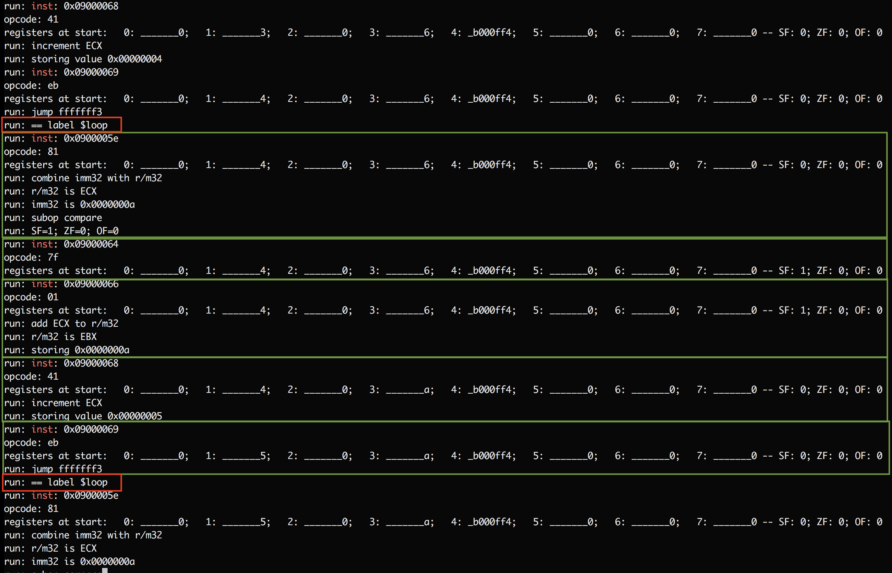
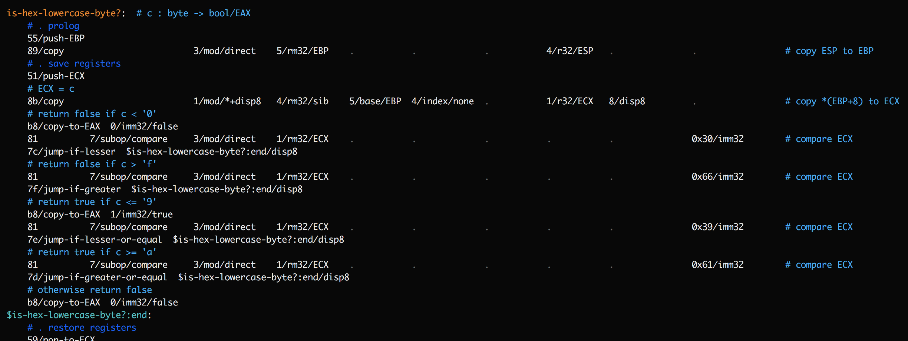

## SubX: A minimalist assembly language for a subset of the x86 ISA

SubX is a simple, minimalist stack for programming your computer.

  ```sh
  $ git clone https://github.com/akkartik/mu
  $ cd mu/subx
  $ ./subx  # print out a help message
  ```

SubX is designed:

* to explore ways to turn arbitrary manual tests into reproducible automated tests,
* to be easy to implement in itself, and
* to help learn and teach the x86 instruction set.

It requires a Unix-like environment with a C++ compiler (Linux or BSD or Mac
OS). Running `subx` will transparently compile it as necessary.

[](https://travis-ci.org/akkartik/mu)

You can generate native ELF binaries with it that run on a bare Linux
kernel. No other dependencies needed.

  ```sh
  $ ./subx translate examples/ex1.subx -o examples/ex1
  $ ./examples/ex1  # only on Linux
  $ echo $?
  42
 ```

You can run the generated binaries on an interpreter/VM for better error
messages.

  ```sh
  $ ./subx run examples/ex1  # on Linux or BSD or OS X
  $ echo $?
  42
  ```

Emulated runs generate a trace that permits [time-travel debugging](https://github.com/akkartik/mu/blob/master/browse_trace/Readme.md).

  ```sh
  $ ./subx --debug translate examples/factorial.subx -o examples/factorial
  saving address->label information to 'labels'
  saving address->source information to 'source_lines'

  $ ./subx --debug --trace run examples/factorial
  saving trace to 'last_run'

  $ ../browse_trace/browse_trace last_run  # text-mode debugger UI
  ```

You can write tests for your assembly programs. The entire stack is thoroughly
covered by automated tests. SubX's tagline: tests before syntax.

  ```sh
  $ ./subx test
  $ ./subx run apps/factorial test
  ```

You can use it to learn about the x86 processor that (almost certainly) runs
your computer. (See below.)

You can read its tiny zero-dependency internals and understand how they work.
You can hack on it, and its thorough tests will raise the alarm when you break
something.

Eventually you will be able to program in higher-level notations. But you'll
always have tests as guardrails and traces for inspecting runs. The entire
stack will always be designed for others to comprehend. You'll always be
empowered to understand how things work, and change what doesn't work for you.
You'll always be expected to make small changes during upgrades.

## What it looks like

Here is the first example we ran above, a program that just returns 42:

  ```sh
  bb/copy-to-EBX  0x2a/imm32  # 42 in hex
  b8/copy-to-EAX  1/imm32/exit
  cd/syscall  0x80/imm8
  ```

Every line contains at most one instruction. Instructions consist of words
separated by whitespace. Words may be _opcodes_ (defining the operation being
performed) or _arguments_ (specifying the data the operation acts on). Any
word can have extra _metadata_ attached to it after `/`. Some metadata is
required (like the `/imm32` and `/imm8` above), but unrecognized metadata is
silently skipped so you can attach comments to words (like the instruction
name `/copy-to-EAX` above, or the `/exit` operand).

SubX doesn't provide much syntax (there aren't even the usual mnemonics for
opcodes), but it _does_ provide error-checking. If you miss an operand or
accidentally add an extra operand you'll get a nice error. SubX won't arbitrarily
interpret bytes of data as instructions or vice versa.

So much for syntax. What do all these numbers actually _mean_? SubX supports a
small subset of the 32-bit x86 instruction set that likely runs on your
computer. (Think of the name as short for "sub-x86".) Instructions operate on
a few registers:

* Six general-purpose 32-bit registers: EAX, EBX, ECX, EDX, ESI and EDI
* Two additional 32-bit registers: ESP and EBP (I suggest you only use these to
  manage the call stack.)
* Four 1-bit _flag_ registers for conditional branching:
  - zero/equal flag ZF
  - sign flag SF
  - overflow flag OF
  - carry flag CF

SubX programs consist of instructions like `89/copy`, `01/add`, `3d/compare`
and `52/push-ECX` which modify these registers as well as a byte-addressable
memory. For a complete list of supported instructions, run `subx help opcodes`.

(SubX doesn't support floating-point registers yet. Intel processors support
an 8-bit mode, 16-bit mode and 64-bit mode. SubX will never support them.
There are other flags. SubX will never support them. There are also _many_
more instructions that SubX will never support.)

It's worth distinguishing between an instruction's _operands_ and its _arguments_.
Arguments are provided directly in instructions. Operands are pieces of data
in register or memory that are operated on by instructions. Intel processors
determine operands from arguments in fairly complex ways.

## Lengthy interlude: How x86 instructions compute operands

The [Intel processor manual](http://www.intel.com/content/dam/www/public/us/en/documents/manuals/64-ia-32-architectures-software-developer-instruction-set-reference-manual-325383.pdf)
is the final source of truth on the x86 instruction set, but it can be
forbidding to make sense of, so here's a quick orientation. You will need
familiarity with binary numbers, and maybe a few other things. Email [me](mailto:mu@akkartik.com)
any time if something isn't clear. I love explaining this stuff for as long as
it takes. The bad news is that it takes some getting used to. The good news is
that internalizing the next 500 words will give you a significantly deeper
understanding of your computer.

Most instructions operate on an operand in register or memory ('reg/mem'), and
a second operand in a register. The register operand is specified fairly
directly using the 3-bit `/r32` argument:

  - 0 means register `EAX`
  - 1 means register `ECX`
  - 2 means register `EDX`
  - 3 means register `EBX`
  - 4 means register `ESP`
  - 5 means register `EBP`
  - 6 means register `ESI`
  - 7 means register `EDI`

The reg/mem operand, however, gets complex. It can be specified by 1-7
arguments, each ranging in size from 2 bits to 4 bytes.

The key argument that's always present for reg/mem operands is `/mod`, the
_addressing mode_. This is a 2-bit argument that can take 4 possible values,
and it determines what other arguments are required, and how to interpret
them.

* If `/mod` is `3`: the operand is in the register described by the 3-bit
  `/rm32` argument similarly to `/r32` above.

* If `/mod` is `0`: the operand is in the address provided in the register
  described by `/rm32`. That's `*rm32` in C syntax.

* If `/mod` is `1`: the operand is in the address provided by adding the
  register in `/rm32` with the (1-byte) displacement. That's `*(rm32 + disp8)`
  in C syntax.

* If `/mod` is `2`: the operand is in the address provided by adding the
  register in `/rm32` with the (4-byte) displacement. That's `*(/rm32 +
  disp32)` in C syntax.

In the last three cases, one exception occurs when the `/rm32` argument
contains `4`. Rather than encoding register `ESP`, it means the address is
provided by three _whole new_ arguments (`/base`, `/index` and `/scale`) in a
_totally_ different way:

  ```
  reg/mem = *(base + index * 2^scale)
  ```

(There are a couple more exceptions ☹; see [Table 2-2](modrm.pdf) and [Table 2-3](sib.pdf)
of the Intel manual for the complete story.)

Phew, that was a lot to take in. Some examples to work through as you reread
and digest it:

1. To read directly from the EAX register, `/mod` must be `3` (direct mode),
   and `/rm32` must be `0`. There must be no `/base`, `/index` or `/scale`
   arguments.

1. To read from `*EAX` (in C syntax), `/mod` must be `0` (indirect mode), and
   the `/rm32` argument must be `0`. There must be no `/base`, `/index` or
   `/scale` arguments.

1. To read from `*(EAX+4)`, `/mod` must be `1` (indirect + disp8 mode),
   `/rm32` must be `0`, there must be no SIB byte, and there must be a single
   displacement byte containing `4`.

1. To read from `*(EAX+ECX+4)`, one approach would be to set `/mod` to `1` as
   above, `/rm32` to `4` (SIB byte next), `/base` to `0`, `/index` to `1`
   (ECX) and a single displacement byte to `4`. (What should the `scale` bits
   be? Can you think of another approach?)

1. To read from `*(EAX+ECX+1000)`, one approach would be:
   - `/mod`: `2` (indirect + disp32)
   - `/rm32`: `4` (`/base`, `/index` and `/scale` arguments required)
   - `/base`: `0` (EAX)
   - `/index`: `1` (ECX)
   - `/disp32`: 4 bytes containing `1000`

## Putting it all together

Here's a more meaty example:


This program sums the first 10 natural numbers. By convention I use horizontal
tabstops to help read instructions, dots to help follow the long lines,
comments before groups of instructions to describe their high-level purpose,
and comments at the end of complex instructions to state the low-level
operation they perform. Numbers are always in hexadecimal (base 16) and must
start with a digit ('0'..'9'); use the '0x' prefix when a number starts with a
letter ('a'..'f'). I tend to also include it as a reminder when numbers look
like decimal numbers.

Try running this example now:

```sh
$ ./subx translate examples/ex3.subx -o examples/ex3
$ ./subx run examples/ex3
$ echo $?
55
```

If you're on Linux you can also run it natively:

```sh
$ ./examples/ex3
$ echo $?
55
```

Use it now to follow along for a more complete tour of SubX syntax.

## The syntax of SubX programs

SubX programs map to the same ELF binaries that a conventional Linux system
uses. Linux ELF binaries consist of a series of _segments_. In particular, they
distinguish between code and data. Correspondingly, SubX programs consist of a
series of segments, each starting with a header line: `==` followed by a name
and approximate starting address.

All code must lie in a segment called 'code'. Execution begins at the start of
the `code` segment by default.

You can reuse segment names:

```
== code
...A...

== data
...B...

== code
...C...
```

The `code` segment now contains the instructions of `A` as well as `C`.

Within the `code` segment, each line contains a comment, label or instruction.
Comments start with a `#` and are ignored. Labels should always be the first
word on a line, and they end with a `:`.

Instruction arguments must specify their type, from:
  - `/mod`
  - `/rm32`
  - `/r32`
  - `/subop` (sometimes the `/r32` bits in an instruction are used as an extra opcode)
  - displacement: `/disp8` or `/disp32`
  - immediate: `/imm8` or `/imm32`

Different instructions (opcodes) require different arguments. SubX will
validate each instruction in your programs, and raise an error anytime you
miss or spuriously add an argument.

I recommend you order arguments consistently in your programs. SubX allows
arguments in any order, but only because that's simplest to explain/implement.
Switching order from instruction to instruction is likely to add to the
reader's burden. Here's the order I've been using after opcodes:

```
        |<--------- reg/mem --------->|        |<- reg/mem? ->|
/subop  /mod /rm32  /base /index /scale  /r32   /displacement   /immediate
```

Instructions can refer to labels in displacement or immediate arguments, and
they'll obtain a value based on the address of the label: immediate arguments
will contain the address directly, while displacement arguments will contain
the difference between the address and the address of the current instruction.
The latter is mostly useful for `jump` and `call` instructions.

Functions are defined using labels. By convention, labels internal to functions
(that must only be jumped to) start with a `$`. Any other labels must only be
called, never jumped to. All labels must be unique.

A special label is `Entry`, which can be used to specify/override the entry
point of the program. It doesn't have to be unique, and the latest definition
will override earlier ones.

(The `Entry` label, along with duplicate segment headers, allows programs to
be built up incrementally out of multiple [_layers_](http://akkartik.name/post/wart-layers).)

The data segment consists of labels as before and byte values. Referring to
data labels in either `code` segment instructions or `data` segment values
(using the `imm32` metadata either way) yields their address.

Automatic tests are an important part of SubX, and there's a simple mechanism
to provide a test harness: all functions that start with `test-` are called in
turn by a special, auto-generated function called `run-tests`. How you choose
to call it is up to you.

I try to keep things simple so that there's less work to do when I eventually
implement SubX in SubX. But there _is_ one convenience: instructions can
provide a string literal surrounded by quotes (`"`) in an `imm32` argument.
SubX will transparently copy it to the `data` segment and replace it with its
address. Strings are the only place where a SubX word is allowed to contain
spaces.

That should be enough information for writing SubX programs. The `examples/`
directory provides some fodder for practice, giving a more gradual introduction
to SubX features. This repo includes the binary for all examples. At any
commit, an example's binary should be identical bit for bit with the result of
translating the corresponding `.subx` file. The binary should also be natively
runnable on a Linux system running on Intel x86 processors, either 32- or
64-bit. If either of these invariants is broken it's a bug on my part.

## Roadmap and status

* Bootstrapping a SubX-\>ELF translator in SubX

  1. [Converting ascii hex bytes to binary.](http://akkartik.github.io/mu/html/subx/apps/hex.subx.html) (✓)
  2. [Packing bitfields for x86 instructions into bytes.](http://akkartik.github.io/mu/html/subx/apps/pack.subx.html) (✓)
  3. [Combining segments with the same name.](http://akkartik.github.io/mu/html/subx/apps/assort.subx.html) (✓)
  4. [Support for string literals.](http://akkartik.github.io/mu/html/subx/apps/dquotes.subx.html) (✓)
  5. [Replacing addresses with labels.](https://github.com/akkartik/mu/pull/34) (10% complete)

* Testable, dependency-injected vocabulary of primitives
  - Streams: `read()`, `write()`. (✓)
  - `exit()` (✓)
  - Sockets
  - Files
  - Concurrency, and a framework for testing blocking code

* Using the trace in [white-box tests](https://git.sr.ht/~akkartik/basic-whitebox-test/tree/master/Readme.md)
  for performance, fault tolerance, etc.

* Higher-level notations. Like programming languages, but with thinner
  implementations that you can -- and are expected to! -- modify.

## Running

`subx` currently has the following sub-commands:

* `subx help`: some helpful documentation to have at your fingertips.

* `subx test`: runs all automated tests.

* `subx translate <input files> -o <output ELF binary>`: translates `.subx`
  files into an executable ELF binary.

* `subx run <ELF binary>`: simulates running the ELF binaries emitted by `subx
  translate`. Useful for debugging, and also enables more thorough testing of
  `translate`.

  Remember, not all 32-bit Linux binaries are guaranteed to run. I'm not
  building general infrastructure here for all of the x86 instruction set.
  SubX is about programming with a small, regular subset of 32-bit x86.

## A few hints for debugging

Writing programs in SubX is surprisingly pleasant and addictive. Reading
programs is a work in progress, and hopefully the extensive unit tests help.
However, _debugging_ programs is where one really faces up to the low-level
nature of SubX. Even the smallest modifications need testing to make sure they
work. In my experience, there is no modification so small that I get it working
on the first attempt. And when it doesn't work, there are no clear error
messages. Machine code is too simple-minded for that. You can't use a debugger,
since SubX's simplistic ELF binaries contain no debugging information. So
debugging requires returning to basics and practicing with a new, more
rudimentary but hopefully still workable toolkit:

* Start by nailing down a concrete set of steps for reproducibly obtaining the
  error or erroneous behavior.

* If possible, turn the steps into a failing test. It's not always possible,
  but SubX's primary goal is to keep improving the variety of tests one can
  write.

* Start running the single failing test alone. This involves modifying the top
  of the program (or the final `.subx` file passed in to `subx translate`) by
  replacing the call to `run-tests` with a call to the appropriate `test-`
  function.

* Generate a trace for the failing test while running your program in emulated
  mode (`subx run`):
  ```
  $ ./subx translate input.subx -o binary
  $ ./subx --trace run binary arg1 arg2  2>trace
  ```
  The ability to generate a trace is the essential reason for the existence of
  `subx run` mode. It gives far better visibility into program internals than
  running natively.

* As a further refinement, it is possible to render label names in the trace
  by adding a second flag to both the `translate` and `run` commands:
  ```
  $ ./subx --debug translate input.subx -o binary
  $ ./subx --debug --trace run binary arg1 arg2  2>trace
  ```
  `subx --debug translate` emits a mapping from label to address in a file
  called `labels`. `subx --debug --trace run` reads in the `labels` file at
  the start and prints out any matching label name as it traces each instruction
  executed.

  Here's a sample of what a trace looks like, with a few boxes highlighted:

  

  Each of the green boxes shows the trace emitted for a single instruction.
  It starts with a line of the form `run: inst: ___` followed by the opcode
  for the instruction, the state of registers before the instruction executes,
  and various other facts deduced during execution. Some instructions first
  print a matching label. In the above screenshot, the red boxes show that
  address `0x0900005e` maps to label `$loop` and presumably marks the start of
  some loop. Function names get similar `run: == label` lines.

* One trick when emitting traces with labels:
  ```
  $ grep label trace
  ```
  This is useful for quickly showing you the control flow for the run, and the
  function executing when the error occurred. I find it useful to start with
  this information, only looking at the complete trace after I've gotten
  oriented on the control flow. Did it get to the loop I just modified? How
  many times did it go through the loop?

* Once you have SubX displaying labels in traces, it's a short step to modify
  the program to insert more labels just to gain more insight. For example,
  consider the following function:

  

  This function contains a series of jump instructions. If a trace shows
  `is-hex-lowercase-byte?` being encountered, and then `$is-hex-lowercase-byte?:end`
  being encountered, it's still ambiguous what happened. Did we hit an early
  exit, or did we execute all the way through? To clarify this, add temporary
  labels after each jump:

  

  Now the trace should have a lot more detail on which of these labels was
  reached, and precisely when the exit was taken.

* If you find yourself wondering, "when did the contents of this memory
  address change?", `subx run` has some rudimentary support for _watch
  points_. Just insert a label starting with `$watch-` before an instruction
  that writes to the address, and its value will start getting dumped to the
  trace after every instruction thereafter.

* Once we have a sense for precisely which instructions we want to look at,
  it's time to look at the trace as a whole. Key is the state of registers
  before each instruction. If a function is receiving bad arguments it becomes
  natural to inspect what values were pushed on the stack before calling it,
  tracing back further from there, and so on.

  I occasionally want to see the precise state of the stack segment, in which
  case I uncomment a commented-out call to `dump_stack()` in the `vm.cc`
  layer. It makes the trace a lot more verbose and a lot less dense, necessitating
  a lot more scrolling around, so I keep it turned off most of the time.

* If the trace seems overwhelming, try [browsing it](https://github.com/akkartik/mu/blob/master/browse_trace/Readme.md)
  in the 'time-travel debugger'.

Hopefully these hints are enough to get you started. The main thing to
remember is to not be afraid of modifying the sources. A good debugging
session gets into a nice rhythm of generating a trace, staring at it for a
while, modifying the sources, regenerating the trace, and so on. Email
[me](mailto:mu@akkartik.com) if you'd like another pair of eyes to stare at a
trace, or if you have questions or complaints.

## Reference documentation on available primitives

### Data Structures

* Kernel strings: null-terminated arrays of bytes. Unsafe and to be avoided,
  but needed for interacting with the kernel.

* Strings: length-prefixed arrays of bytes. String contents are preceded by
  4 bytes (32 bytes) containing the `length` of the array.

* Slices: a pair of 32-bit addresses denoting a [half-open](https://en.wikipedia.org/wiki/Interval_(mathematics))
  \[`start`, `end`) interval to live memory with a consistent lifetime.

  Invariant: `start` <= `end`

* Streams: strings prefixed by 32-bit `write` and `read` indexes that the next
  write or read goes to, respectively.

  * offset 0: write index
  * offset 4: read index
  * offset 8: length of array (in bytes)
  * offset 12: start of array data

  Invariant: 0 <= `read` <= `write` <= `length`

* File descriptors (fd): Low-level 32-bit integers that the kernel uses to
  track files opened by the program.

* File: 32-bit value containing either a fd or an address to a stream (fake
  file).

* Buffered files (buffered-file): Contain a file descriptor and a stream for
  buffering reads/writes. Each `buffered-file` must exclusively perform either
  reads or writes.

### 'system calls'

As I said at the top, a primary design goal of SubX (and Mu more broadly) is
to explore ways to turn arbitrary manual tests into reproducible automated
tests. SubX aims for this goal by baking testable interfaces deep into the
stack, at the OS syscall level. The idea is that every syscall that interacts
with hardware (and so the environment) should be *dependency injected* so that
it's possible to insert fake hardware in tests.

But those are big goals. Here are the syscalls I have so far:

* `write`: takes two arguments, a file `f` and an address to array `s`.

  Comparing this interface with the Unix `write()` syscall shows two benefits:

  1. SubX can handle 'fake' file descriptors in tests.

  1. `write()` accepts buffer and its length in separate arguments, which
     requires callers to manage the two separately and so can be error-prone.
     SubX's wrapper keeps the two together to increase the chances that we
     never accidentally go out of array bounds.

* `read`: takes two arguments, a file `f` and an address to stream `s`. Reads
  as much data from `f` as can fit in (the free space of) `s`.

  Like with `write()`, this wrapper around the Unix `read()` syscall adds the
  ability to handle 'fake' file descriptors in tests, and reduces the chances
  of clobbering outside array bounds.

  One bit of weirdness here: in tests we do a redundant copy from one stream
  to another. See [the comments before the implementation](http://akkartik.github.io/mu/html/subx/058read.subx.html)
  for a discussion of alternative interfaces.

* `stop`: takes two arguments:
  - `ed` is an address to an _exit descriptor_. Exit descriptors allow us to
    `exit()` the program in production, but return to the test harness within
    tests. That allows tests to make assertions about when `exit()` is called.
  - `value` is the status code to `exit()` with.

  For more details on exit descriptors and how to create one, see [the
  comments before the implementation](http://akkartik.github.io/mu/html/subx/057stop.subx.html).

* `new-segment`

  Allocates a whole new segment of memory for the program, discontiguous with
  both existing code and data (heap) segments. Just a more opinionated form of
  [`mmap`](http://man7.org/linux/man-pages/man2/mmap.2.html).

* `allocate`: takes two arguments, an address to allocation-descriptor `ad`
  and an integer `n`

  Allocates a contiguous range of memory that is guaranteed to be exclusively
  available to the caller. Returns the starting address to the range in `EAX`.

  An allocation descriptor tracks allocated vs available addresses in some
  contiguous range of memory. The int specifies the number of bytes to allocate.

  Explicitly passing in an allocation descriptor allows for nested memory
  management, where a sub-system gets a chunk of memory and further parcels it
  out to individual allocations. Particularly helpful for (surprise) tests.

* ... _(to be continued)_

I will continue to import syscalls over time from [the old Mu VM in the parent
directory](https://github.com/akkartik/mu), which has experimented with
interfaces for the screen, keyboard, mouse, disk and network.

### primitives built atop system calls

_(Compound arguments are usually passed in by reference. Where the results are
compound objects that don't fit in a register, the caller usually passes in
allocated memory for it.)_

#### assertions for tests
* `check-ints-equal`: fails current test if given ints aren't equal
* `check-stream-equal`: fails current test if stream doesn't match string
* `check-next-stream-line-equal`: fails current test if next line of stream
  until newline doesn't match string

#### error handling
* `error`: takes three arguments, an exit-descriptor, a file and a string (message)

  Prints out the message to the file and then exits using the provided
  exit-descriptor.

* `error-byte`: like `error` but takes an extra byte value that it prints out
  at the end of the message.

#### predicates
* `kernel-string-equal?`: compares a kernel string with a string
* `string-equal?`: compares two strings
* `stream-data-equal?`: compares a stream with a string
* `next-stream-line-equal?`: compares with string the next line in a stream, from
  `read` index to newline

* `slice-empty?`: checks if the `start` and `end` of a slice are equal
* `slice-equal?`: compares a slice with a string
* `slice-starts-with?`: compares the start of a slice with a string
* `slice-ends-with?`: compares the end of a slice with a string

#### writing to disk
* `write`: string -> file
  - Can also be used to cat a string into a stream.
  - Will abort the entire program if destination is a stream and doesn't have
    enough room.
* `write-stream`: stream -> file
  - Can also be used to cat one stream into another.
  - Will abort the entire program if destination is a stream and doesn't have
    enough room.
* `write-slice`: slice -> stream
  - Will abort the entire program if there isn't enough room in the
    destination stream.
* `append-byte`: int -> stream
  - Will abort the entire program if there isn't enough room in the
    destination stream.
* `append-byte-hex`: int -> stream
  - textual representation in hex, no '0x' prefix
  - Will abort the entire program if there isn't enough room in the
    destination stream.
* `print-int32`: int -> stream
  - textual representation in hex, including '0x' prefix
  - Will abort the entire program if there isn't enough room in the
    destination stream.
* `write-buffered`: string -> buffered-file
* `write-slice-buffered`: slice -> buffered-file
* `flush`: buffered-file
* `write-byte-buffered`: int -> buffered-file
* `print-byte-buffered`: int -> buffered-file
  - textual representation in hex, no '0x' prefix
* `print-int32-buffered`: int -> buffered-file
  - textual representation in hex, including '0x' prefix

#### reading from disk
* `read`: file -> stream
  - Can also be used to cat one stream into another.
  - Will silently stop reading when destination runs out of space.
* `read-byte-buffered`: buffered-file -> byte
* `read-line-buffered`: buffered-file -> stream
  - Will abort the entire program if there isn't enough room.

#### non-IO operations on streams
* `new-stream`: allocates space for a stream of `n` elements, each occupying
  `b` bytes.
  - Will abort the entire program if `n*b` requires more than 32 bits.
* `clear-stream`: resets everything in the stream to `0` (except its `length`).
* `rewind-stream`: resets the read index of the stream to `0` without modifying
  its contents.

#### reading/writing hex representations of integers
* `is-hex-int?`: takes a slice argument, returns boolean result in `EAX`
* `parse-hex-int`: takes a slice argument, returns int result in `EAX`
* `is-hex-digit?`: takes a 32-bit word containing a single byte, returns
  boolean result in `EAX`.
* `from-hex-char`: takes a hexadecimal digit character in EAX, returns its
  numeric value in `EAX`
* `to-hex-char`: takes a single-digit numeric value in EAX, returns its
  corresponding hexadecimal character in `EAX`

#### tokenization

from a stream:
* `next-token`: stream, delimiter byte -> slice
* `skip-chars-matching`: stream, delimiter byte
* `skip-chars-not-matching`: stream, delimiter byte

from a slice:
* `next-token-from-slice`: start, end, delimiter byte -> slice
  - Given a slice and a delimiter byte, returns a new slice inside the input
    that ends at the delimiter byte.

* `skip-chars-matching-in-slice`: curr, end, delimiter byte -> new-curr (in `EAX`)
* `skip-chars-not-matching-in-slice`:  curr, end, delimiter byte -> new-curr (in `EAX`)

## Conclusion

The hypothesis of Mu and SubX is that designing the entire system to be
testable from day 1 and from the ground up would radically impact the culture
of the eco-system in a way that no bolted-on tool or service at higher levels
can replicate:

* Tests would make it easier to write programs that can be easily understood
  by newcomers.

* More broad-based understanding would lead to more forks.

* Tests would make it easy to share code across forks. Copy the tests over,
  and then copy code over and polish it until the tests pass. Manual work, but
  tractable and without major risks.

* The community would gain a diversified portfolio of forks for each program,
  a “wavefront” of possible combinations of features and alternative
  implementations of features. Application writers who wrote thorough tests
  for their apps (something they just can’t do today) would be able to bounce
  around between forks more easily without getting locked in to a single one
  as currently happens.

* There would be a stronger culture of reviewing the code for programs you use
  or libraries you depend on. [More eyeballs would make more bugs shallow.](https://en.wikipedia.org/wiki/Linus%27s_Law)

## Resources

* [Single-page cheatsheet for the x86 ISA](https://net.cs.uni-bonn.de/fileadmin/user_upload/plohmann/x86_opcode_structure_and_instruction_overview.pdf)
  (pdf; [cached local copy](https://github.com/akkartik/mu/blob/master/subx/cheatsheet.pdf))
* [Concise reference for the x86 ISA](https://c9x.me/x86)
* [Intel processor manual](http://www.intel.com/content/dam/www/public/us/en/documents/manuals/64-ia-32-architectures-software-developer-instruction-set-reference-manual-325383.pdf) (pdf)
* [Some details on the unconventional organization of this project.](http://akkartik.name/post/four-repos)

## Inspirations

* [&ldquo;Creating tiny ELF executables&rdquo;](https://www.muppetlabs.com/~breadbox/software/tiny/teensy.html)
* [&ldquo;Bootstrapping a compiler from nothing&rdquo;](http://web.archive.org/web/20061108010907/http://www.rano.org/bcompiler.html)
* Forth implementations like [StoneKnifeForth](https://github.com/kragen/stoneknifeforth)
