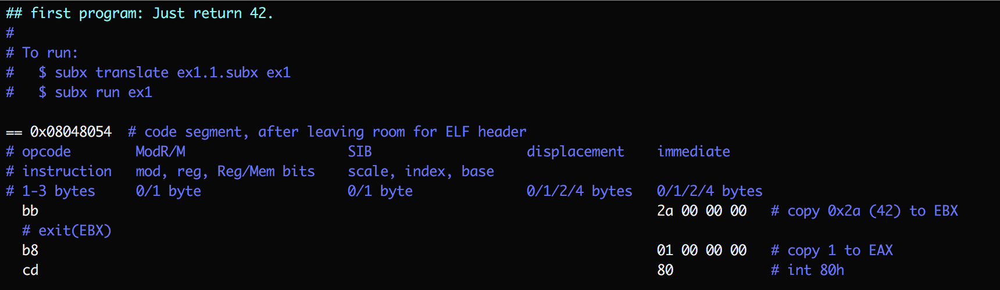

## What is this? 

A suite of tools for directly programming in (32-bit x86) machine code without
a compiler. The generated ELF binaries require just a Unix-like kernel to run.
(It isn't self-hosted yet, so generating the binaries requires a C compiler
and libc.)

## Why in the world?

1. It seems wrong-headed that our computers look polished but are plagued by
   foundational problems of security and reliability. I'd like to learn to
   walk before I try to run, use the computer only to check my program for
   errors rather than to hide low-level details. This approach adds to the
   burden of the programmer, but may make the hard problems more tractable.
   We can always add HLLs back once the foundations are redone, but it seems
   valuable to not require a HLL to build the foundations.

2. The software in our computers has grown incomprehensible. Nobody
   understands it all, not even experts. Even simple programs written by a
   single author require lots of time for others to comprehend. Compilers are
   a prime example, growing so complex that programmers have to choose to
   either program them or use them. I'd like to explore how much of a HLL I
   can build without an optimizing compiler, and see if the result is more
   comprehensible by others. ([More details.](http://akkartik.name/about))

3. I want to learn about the internals of the infrastructure we all rely on in
   our lives.

## Running

```
$ git clone https://github.com/akkartik/mu
$ cd mu/subx
$ ./subx
```

Running `subx` will transparently compile it as necessary.

## Usage

`subx` currently has the following sub-commands:

* `subx test`: runs all automated tests.

* `subx translate <input file> <output ELF binary>`: translates a text file
  containing hex bytes and macros into an executable ELF binary.

* `subx run <ELF binary>`: simulates running the ELF binaries emitted by `subx
  translate`. Useful for debugging, and also enables more thorough testing of
  `translate`.

Putting them together, build and run one of the example programs:



```
$ ./subx translate ex1.1.subx ex1
$ ./subx run ex1
```

If you're running on Linux, `ex1` will also be runnable directly:
```
$ chmod +x ex1
$ ./ex1
```

I'm not building general infrastructure here for all of the x86 ISA and ELF
format. SubX is about programming with a small, regular subset of 32-bit x86:

* Only instructions that operate on the 32-bit E\*X registers. (No
  floating-point yet.)
* Only instructions that assume a flat address space; no instructions that use
  segment registers.
* No instructions that check the carry or parity flags; arithmetic operations
  always operate on signed integers (while bitwise operations always operate
  on unsigned integers)
* Only relative jump instructions (with 8-bit or 16-bit offsets).

## Resources

* [Single-page cheatsheet for the x86 ISA](https://net.cs.uni-bonn.de/fileadmin/user_upload/plohmann/x86_opcode_structure_and_instruction_overview.pdf)
  (pdf; [cached local copy](https://github.com/akkartik/mu/blob/master/subx/cheatsheet.pdf))
* [Concise reference for the x86 ISA](https://c9x.me/x86)
* [Intel programming manual](http://www.intel.com/content/dam/www/public/us/en/documents/manuals/64-ia-32-architectures-software-developer-instruction-set-reference-manual-325383.pdf) (pdf)

## Inspirations

* [&ldquo;Creating tiny ELF executables&rdquo;](https://www.muppetlabs.com/~breadbox/software/tiny/teensy.html)
* [&ldquo;Bootstrapping a compiler from nothing&rdquo;](http://web.archive.org/web/20061108010907/http://www.rano.org/bcompiler.html)
* Forth implementations like [StoneKnifeForth](https://github.com/kragen/stoneknifeforth)
