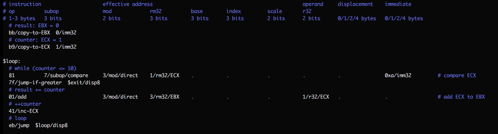
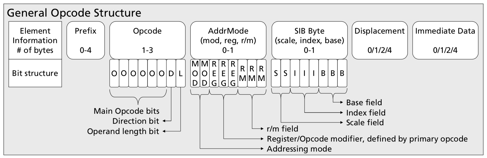

## SubX: a simplistic assembly language

SubX is a minimalist assembly language designed:
* to explore ways to turn arbitrary manual tests into reproducible automated
  tests,
* to be easy to implement in itself, and
* to help learn and teach the x86 instruction set.

Expanding on the first bullet, it hopes to support more comprehensive tests
by:

1. Designing testable wrappers for operating system interfaces. For example,
   it can `read()` from or `write()` to fake in-memory files in tests. We'll
   gradually port ideas for other syscalls from [the old Mu VM in the parent
   directory](https://github.com/akkartik/mu).

2. Supporting a special _trace_ stream in addition to the default `stdin`,
   `stdout` and `stderr` streams. The trace stream is designed for programs to
   emit structured facts they deduce about their domain as they execute. Tests
   can then check the set of facts deduced in addition to the results of the
   function under test. This form of _automated whitebox testing_ permits
   writing tests for performance, fault tolerance, deadlock-freedom, memory
   usage, etc. For example, if a sort function traces each swap, a performance
   test could check that the number of swaps doesn't quadruple when the size
   of the input doubles.

The hypothesis is that designing the entire system to be testable from day 1
and from the ground up would radically impact the culture of an eco-system in
a way that no bolted-on tool or service at higher levels can replicate. It
would make it easier to write programs that can be [easily understood by newcomers](http://akkartik.name/about).
It would reassure authors that an app is free from regression if all automated
tests pass. It would make the stack easy to rewrite and simplify by dropping
features, without fear that a subset of targeted apps might break. As a result
people might fork projects more easily, and also exchange code between
disparate forks more easily (copy the tests over, then try copying code over
and making tests pass, rewriting and polishing where necessary). The community
would have in effect a diversified portfolio of forks, a “wavefront” of
possible combinations of features and alternative implementations of features
instead of the single trunk with monotonically growing complexity that we get
today. Application writers who wrote thorough tests for their apps (something
they just can’t do today) would be able to bounce around between forks more
easily without getting locked in to a single one as currently happens.

However, that vision is far away, and SubX is just a first, hesitant step.
SubX supports a small, regular subset of the 32-bit x86 instruction set.
(Think of the name as short for "sub-x86".)

  - Only instructions that operate on the 32-bit integer E\*X registers, and a
    couple of instructions for operating on 8-bit values. No floating-point
    yet. Most legacy registers will never be supported.

  - Only instructions that assume a flat address space; legacy instructions
    that use segment registers will never be supported.

  - No instructions that check the carry or parity flags; arithmetic operations
    always operate on signed integers (while bitwise operations always operate
    on unsigned integers).

  - Only relative jump instructions (with 8-bit or 32-bit offsets).

The (rudimentary, statically linked) ELF binaries SubX generates can be run
natively on Linux, and they require only the Linux kernel.

_Status_: SubX is currently implemented in C++, so you need a C++ compiler and
libraries to build SubX binaries. However, I'm learning how to build a
compiler in assembly language by working through [Jack Crenshaw's "Let's build
a compiler" series](https://compilers.iecc.com/crenshaw). Look in [the `apps/`
sub-directory](http://akkartik.github.io/mu/html/subx/apps/crenshaw2-1.subx.html).

## An example program

In the interest of minimalism, SubX requires more knowledge than traditional
assembly languages of the x86 instructions it supports. Here's an example
SubX program, using one line per instruction:



This program sums the first 10 natural numbers. By convention I use horizontal
tabstops to help read instructions, dots to help follow the long lines,
comments before groups of instructions to describe their high-level purpose,
and comments at the end of complex instructions to state the low-level
operation they perform. Numbers are always shown in hexadecimal (base 16).

As you can see, programming in SubX requires the programmer to know the (kinda
complex) structure of x86 instructions, all the different operands that an
instruction can have, their layout in bytes (for example, the `subop` and
`r32` fields use the same bits, so an instruction can't have both; more on
this below), the opcodes for supported instructions, and so on.

While SubX syntax is fairly dumb, the error-checking is relatively smart. I
try to provide clear error messages on instructions missing operands or having
unexpected operands. Either case would otherwise cause instruction boundaries
to diverge from what you expect, and potentially lead to errors far away. It's
useful to catch such errors early.

Try running this example now:

```
$ git clone https://github.com/akkartik/mu
$ cd mu/subx
$ ./subx translate examples/ex3.subx -o examples/ex3
$ ./subx run examples/ex3
$ echo $?
55
```

If you're on Linux you can also run it natively:

```
$ ./examples/ex3
$ echo $?
55
```

[](https://travis-ci.org/akkartik/mu)

The rest of this Readme elaborates on the syntax for SubX programs, starting
with a few prerequisites about the x86 instruction set.

## A quick tour of the x86 instruction set

The [Intel processor manual](http://www.intel.com/content/dam/www/public/us/en/documents/manuals/64-ia-32-architectures-software-developer-instruction-set-reference-manual-325383.pdf)
is the final source of truth on the x86 instruction set, but it can be
forbidding to make sense of, so here's a quick orientation. You will need
familiarity with binary and hexadecimal encodings (starting with '0x') for
numbers, and maybe a few other things. Email [me](mailto:mu@akkartik.com)
anytime if something isn't clear. I love explaining this stuff for as long as
it takes.

The x86 instructions SubX supports can take anywhere from 1 to 13 bytes. Early
bytes affect what later bytes mean and where an instruction ends. Here's the
big picture of a single x86 instruction from the Intel manual:



There's a lot here, so let's unpack it piece by piece:

* The prefix bytes are not used by SubX, so ignore them.

* The opcode bytes encode the instruction used. Ignore their internal structure;
  we'll just treat them as a sequence of whole bytes. The opcode sequences
  SubX recognizes are enumerated by running `subx help opcodes`. For more
  details on a specific opcode, consult html guides like https://c9x.me/x86 or
  the Intel manual.

* The addressing mode byte is used by all instructions that take an `rm32`
  operand according to `subx help opcodes`. (That's most instructions.) The
  `rm32` operand shows how these instructions load one operand from memory.
  That operand is encoded by the addressing mode byte and, optionally, the SIB
  (scale, index, base) byte. The `rm32` operand is constructed like this:

  - if `mod` is 3: the contents of the register described by the `r/m` bits.
    - `000` (0) means register `EAX`
    - `001` (1) means register `ECX`
    - `010` (2) means register `EDX`
    - `011` (3) means register `EBX`
    - `100` (4) means register `ESP`
    - `101` (5) means register `EBP`
    - `110` (6) means register `ESI`
    - `111` (7) means register `EDI`

  - if `mod` is 0: `rm32` is the contents of the address provided in the
    register provided by `r/m`. That's `*r/m` in C syntax.

  - if `mod` is 1: the contents of the address provided by adding the register
    in `r/m` with the (1-byte) displacement. That's `*(r/m + disp8)` in C
    syntax.

  - if `mod` is 2: the contents of the address provided by adding the register
    in `r/m` with the (4-byte) displacement. That's `*(r/m + disp32)` in C
    syntax.

  In the last 3 cases, one exception occurs when `r/m` contains `010` or 4.
  Rather than encoding register ESP, '4' means the address is provided by a
  SIB byte next:

  ```
  base * 2^scale + index
  ```

  (There are a couple more exceptions ☹; see [Table 2-2](modrm.pdf) and [Table 2-3](sib.pdf)
  of the Intel manual for the complete story.)

  Phew, that was a lot to take in. Some examples to work through as you reread
  and digest it:

  1. To read directly from the EAX register, `mod` must be `11` or 3 (direct
     mode), and the `r/m` bits must be `000` (EAX). There must be no SIB byte.

  1. To read from `*EAX` in C syntax, `mod` must be `00` (indirect mode), and
     the `r/m` bits must be `00`. There must be no SIB byte.

  1. To read from `*(EAX+4)`, `mod` must be `01` or 1 (indirect + disp8 mode),
     `r/m` must be `000`, there must be no SIB byte, and there must be a
     single displacement byte containing `00000010` or 4.

  1. To read from `*(EAX+ECX+4)`, one approach would be to set `mod` to `01`,
     `r/m` to `100` (SIB byte next), `base` to `000`, `index` to `001` (ECX)
     and a single displacement byte to 4. What should the `scale` bits be? Can
     you think of another approach?

  1. To read from `*(EAX+ECX+0x00f00000)`, one approach would be:
     - `mod`: `10` (indirect + disp32)
     - `r/m`: `100` (SIB byte)
     - `base`: `000` (EAX)
     - `index`: `001` (ECX)
     - `displacement`: 4 bytes containing 0x00f00000

* Back to the instruction picture. We've already covered the SIB byte and most
  of the addressing mode byte. Instructions can also provide a second operand
  as either a displacement or immediate value (the two are distinct because
  some instructions use a displacement as part of `rm32` and an immediate for
  the other operand).

* Finally, the `reg` bits in the addressing mode byte can also encode the
  second operand. Sometimes they can also be part of the opcode bits. For
  example, an operand byte of `ff` and `reg` bits of `001` means "increment
  rm32". (Notice that instructions that use the `reg` bits as a "sub-opcode"
  cannot also use it as a second operand.)

That concludes our quick tour. By this point it's probably clear to you that
the x86 instruction set is overly complicated. Many simpler instruction sets
exist. However, your computer right now likely runs x86 instructions and not
them. Internalizing the last 750 words may allow you to program your computer
fairly directly, with only minimal-going-on-zero reliance on a C compiler.

## The syntax of SubX programs

SubX programs map to the same ELF binaries that a conventional Linux system
uses. Linux ELF binaries consist of a series of _segments_. In particular, they
distinguish between code and data. Correspondingly, SubX programs consist of a
series of segments, each starting with a header line: `==` followed by a name.
The first segment is assumed to be for code, and the second for data. By
convention, I name them `code` and `data`.

Execution always begins at the start of the `code` segment.

You can reuse segment names:

```
== code
...A...

== data
...B...

== code
...C...
```

The code segment now contains the instructions of `A` as well as `C`. `C`
comes _before_ `A`. This order allows me to split SubX programs between
multiple _layers_. A program built with just layer 1 would start executing at
layer 1's first instruction, while one built with layer 1 and layer 2 (in that
order) would start executing at layer 2's first instruction.

Within the code segment, each line contains a comment, label or instruction.
Comments start with a `#` and are ignored. Labels should always be the first
word on a line, and they end with a `:`.

Instructions consist of a sequence of opcode bytes and their operands. Each
opcode and operand can contain _metadata_ after a `/`. Metadata can be either
for SubX or act as a comment for the reader; SubX silently ignores unrecognized
metadata. A single word can contain multiple pieces of metadata, each starting
with a `/`.

SubX uses metadata to express instruction encoding and get decent error
messages. You must tag each instruction operand with the appropriate operand
type:
  - `mod`
  - `rm32` ("r/m" in the x86 instruction diagram above, but we can't use `/`
    in metadata tags)
  - `r32` ("reg" in the x86 diagram)
  - `subop` (for when "reg" in the x86 diagram encodes a sub-opcode rather
    than an operand)
  - displacement: `disp8`, `disp16` or `disp32`
  - immediate: `imm8` or `imm32`

You don't need to remember what order instruction operands are in,
or pack bitfields by hand. SubX will do all that for you. If you get the types
wrong, giving an instruction an incorrect operand or forgetting an operand,
you should get a clear error message. Remember, don't use `subop` (sub-operand
above) and `r32` (reg in the x86 figure above) in a single instruction.

Instructions can refer to labels in displacement or immediate operands, and
they'll obtain a value based on the address of the label: immediate operands
will contain the address directly, while displacement operands will contain
the difference between the address and the address of the current instruction.
The latter is mostly useful for `jump` and `call` instructions.

Functions are defined using labels. By convention, labels internal to functions
(that must only be jumped to) start with a `$`. Any other labels must only be
called, never jumped to.

The data segment consists of labels as before and byte values. Referring to
data labels in either code segment instructions or data segment values (using
the `imm32` metadata either way) yields their address.

Automatic tests are an important part of SubX, and there's a simple mechanism
to provide a test harness: all functions that start with `test-` are called in
turn by a special, auto-generated function called `run-tests`. How you choose
to call it is up to you.

I try to keep things simple so that there's less work to do when I eventually
implement SubX in SubX. But there _is_ one convenience: instructions can
provide a string literal surrounded by quotes (`"`) in an `imm32` operand.
SubX will transparently copy it to the `data` segment and replace it with its
address. Strings are the only place where a SubX operand is allowed to contain
spaces.

That should be enough information for writing SubX programs. The `examples/`
directory provides some fodder for practice, giving a more gradual introduction
to SubX features. This repo includes the binary for all examples. At any
commit, an example's binary should be identical bit for bit with the result of
translating the corresponding `.subx` file. The binary should also be natively
runnable on a Linux system running on Intel x86 processors, either 32- or
64-bit. If either of these invariants is broken it's a bug on my part.

## Running

Running `subx` will transparently compile it as necessary.

`subx` currently has the following sub-commands:

* `subx help`: some helpful documentation to have at your fingertips.

* `subx test`: runs all automated tests.

* `subx translate <input files> -o <output ELF binary>`: translates `.subx`
  files into an executable ELF binary.

* `subx run <ELF binary>`: simulates running the ELF binaries emitted by `subx
  translate`. Useful for debugging, and also enables more thorough testing of
  `translate`.

  Remember, not all 32-bit Linux binaries are guaranteed to run. I'm not
  building general infrastructure here for all of the x86 instruction set.
  SubX is about programming with a small, regular subset of 32-bit x86.

## SubX library

A major goal of SubX is testable wrappers for operating system syscalls.
Here's what I've built so far:

* `write`: takes two arguments, `f` and `s`.
  - `s` is an address to an _array_. Arrays in SubX are always assumed to
    start with a 4-byte length.
  - `f` is either a file descriptor to write `s` to, or (in tests) a _stream_.
    Streams are in-memory buffers that can be read or written. They consist of
    a `data` array of bytes as well as `read` and `write` indexes into the
    array, showing how far we've read and written so far.

  Comparing this interface with the Unix `write()` syscall shows two benefits:

  1. SubX can handle 'fake' file descriptors in tests.

  1. `write()` accepts buffer and its length in separate arguments, which
     requires callers to manage the two separately and so can be error-prone.
     SubX's wrapper keeps the two together to increase the chances that we
     never accidentally go out of array bounds.

* `read`: takes two arguments, `f` and `s`.
  - `s` is an address to a _stream_ to save the read data to. We read as much
    data as can fit in `s`, and no more.
  - `f` is either a file descriptor to write `s` to, or (in tests) a _stream_.

  Like with `write()`, this wrapper around the Unix `read()` syscall adds the
  ability to handle 'fake' file descriptors in tests, and reduces the chances
  of clobbering outside array bounds.

  One bit of weirdness here: in tests we do a redundant copy from one stream
  to another. See [the comments before the implementation](http://akkartik.github.io/mu/html/subx/058read.subx.html)
  for a discussion of alternative interfaces.

* `stop`: takes two arguments:
  - `ed` is an address to an _exit descriptor_. Exit descriptors allow us to
    `exit()` the program normally, but return to the test harness within
    tests. That allows tests to make assertions about when `exit()` is called.
  - `value` is the status code to `exit()` with.

  For more details on exit descriptors and how to create one, see [the
  comments before the implementation](http://akkartik.github.io/mu/html/subx/057stop.subx.html).

* ... _(to be continued)_

## Resources

* [Single-page cheatsheet for the x86 ISA](https://net.cs.uni-bonn.de/fileadmin/user_upload/plohmann/x86_opcode_structure_and_instruction_overview.pdf)
  (pdf; [cached local copy](https://github.com/akkartik/mu/blob/master/subx/cheatsheet.pdf))
* [Concise reference for the x86 ISA](https://c9x.me/x86)
* [Intel processor manual](http://www.intel.com/content/dam/www/public/us/en/documents/manuals/64-ia-32-architectures-software-developer-instruction-set-reference-manual-325383.pdf) (pdf)

## Inspirations

* [&ldquo;Creating tiny ELF executables&rdquo;](https://www.muppetlabs.com/~breadbox/software/tiny/teensy.html)
* [&ldquo;Bootstrapping a compiler from nothing&rdquo;](http://web.archive.org/web/20061108010907/http://www.rano.org/bcompiler.html)
* Forth implementations like [StoneKnifeForth](https://github.com/kragen/stoneknifeforth)
