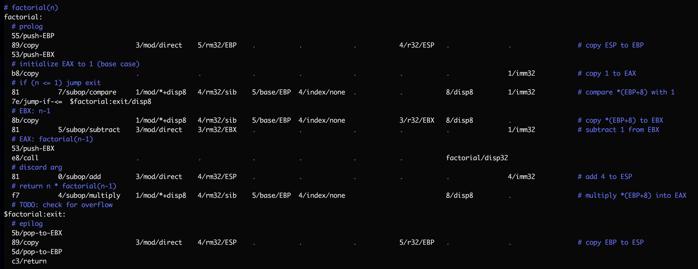

## What is this? 

SubX is a thin layer of syntactic sugar over (32-bit x86) machine code. The
SubX translator (it's too simple to be called a compiler, or even an
assembler) generates ELF binaries that require just a Unix-like kernel to run.
(The translator isn't self-hosted yet; generating the binaries does require a
C++ compiler and runtime.)

## Thin layer of abstraction over machine code, isn't that just an assembler?

Compare some code in Assembly:

```
add EBX, ECX
copy EBX, 0
copy ECX, 1
```

..with the same instructions in SubX:

```
01/add 3/mod/direct 3/rm32/ebx 1/r32/ecx
bb/copy-EBX 0/imm32
b9/copy-ECX 1/imm32
```

Assembly is pretty low-level, but SubX makes Assembly look like the gleaming
chrome of the Starship Enterprise. Opcodes for instructions are explicit, as
are addressing modes and the precise bit fields used to encode them. There is
no portability. Only a subset of x86 is supported, so there's no backwards
compatibility either, zero interoperability with existing libraries. Only
statically linked libraries are supported, so the kernel will inefficiently
juggle multiple copies of the same libraries in RAM.

In exchange for these drawbacks, SubX will hopefully be simpler to implement.
Ideally in itself.

I'm also hoping that SubX will be simpler to program in, that it will fit a
programmer's head better in spite of the lack of syntax. Modern Assembly
supports 50+ years of accretions in the x86 ISA and 40+ years of accumulated
cruft in the toolchain (standard library, ELF format, binutils, linker,
loader).

You may say I just don't understand the toolchain well enough. And that's the
point. I tried, and I failed. Each package above has only a piece of the
puzzle. Learning each of the above tools takes time; figuring out how they all
work together is not a well-supported activity.

My hypothesis is that _it's easier to understand a coherent system written in
machine code than an incoherent system in a high-level language._ To test this
hypothesis, I plan to take a hatchet to [anything I don't understand](https://en.wikipedia.org/wiki/Wikipedia:Chesterton%27s_fence),
but to take full ownership of what's left. Not just how it runs, but the
experience of programming with it. A few basic mechanisms can hopefully be put
together into a more self-explanatory system:

a) Metadata. In the example above, words after a slash (`/`) act as metadata
that doesn't make it into the final binary. Metadata can act as comments for
readers, or as directives for tools operating on SubX code. Programmers will
be encouraged to create new tools of their own.

b) Checks. While SubX doesn't provide syntax, it tries to provide good
guardrails for invalid programs. Metadata specifies which field of an instruction
each operand is intended for. Missing operands are caught before they can
silently mislead instruction decoding. Instructions with unexpected operand
types are immediately flagged. SubX includes an emulator for a subset of x86,
which provides better error messages than native execution for certain kinds
of bad binaries.

c) A test harness. SubX includes automated tests from the start, and the
entire stack is designed to be easy to test. We will provide wrappers for OS
syscalls that allow fakes to be _dependency-injected_ in, expanding the kinds
of tests that can be written. See [the earlier Mu interpreter](https://github.com/akkartik/mu#readme)
for more details.

d) Traces of execution. Writing good error messages for a compiler is a hard
problem, and it can add complexity. We'd like to keep things ergonomic with a
minimum of code, so we will provide a _trace browser_ that allows programmers
to scan the trace of events emitted by SubX leading up to an error message,
drilling down into details as needed. Traces will also be available in tests,
enabling testing for cross-cutting concerns like performance, race conditions,
precise error messages displayed on screen, and so on. The effect is again to
expand the kinds of tests that can be written. [More details.](http://akkartik.name/about)

e) Incremental construction. SubX programs are translated into monolithic ELF
binaries, but you will be able to build just a subset of their code (denominated
in _layers_), and get a running program that passes all its automated tests.
[More details.](https://akkartik.name/post/wart-layers)

It seems wrong-headed that our computers look polished but are plagued by
foundational problems of security and reliability. I'd like to learn to walk
before I try to run. The plan: start out using the computer only to check my
program for errors rather than to hide low-level details. Force myself to
think about security by living with raw machine code for a while. Reintroduce
high level languages (HLLs) only after confidence is regained in the foundations
(and when the foundations are ergonomic enough to support developing a
compiler in them). Delegate only when I can verify with confidence.

## Running

```
$ git clone https://github.com/akkartik/mu
$ cd mu/subx
$ ./subx
```

Running `subx` will transparently compile it as necessary.

## Usage

`subx` currently has the following sub-commands:

* `subx test`: runs all automated tests.

* `subx translate <input file> -o <output ELF binary>`: translates a text file
  containing hex bytes and macros into an executable ELF binary.

* `subx run <ELF binary>`: simulates running the ELF binaries emitted by `subx
  translate`. Useful for debugging, and also enables more thorough testing of
  `translate`.

Putting them together, build and run one of the example programs:



```
$ ./subx translate *.subx apps/factorial.subx -o apps/factorial
$ ./subx run apps/factorial  # returns the factorial of 5
$ echo $?
120  
```

If you're running on Linux, `factorial` will also be runnable directly:
```
$ apps/factorial
```

The `examples/` directory shows some simpler programs giving a more gradual
introduction to SubX features. The repo includes the binary for all examples.
At any commit an example's binary should be identical bit for bit with the
result of translating the .subx file. The binary should also be natively
runnable on a Linux system running on Intel x86 processors, either 32- or
64-bit. If either of these invariants is broken it's a bug on my part.

However, not all 32-bit Linux binaries are guaranteed to be runnable by
`subx`. I'm not building general infrastructure here for all of the x86 ISA
and ELF format. SubX is about programming with a small, regular subset of
32-bit x86:

* Only instructions that operate on the 32-bit integer E\*X registers. (No
  floating-point yet.)
* Only instructions that assume a flat address space; no instructions that use
  segment registers.
* No instructions that check the carry or parity flags; arithmetic operations
  always operate on signed integers (while bitwise operations always operate
  on unsigned integers)
* Only relative jump instructions (with 8-bit or 16-bit offsets).

The ELF binaries generated are statically linked and missing a lot of advanced
ELF features as well. But they will run.

For more details on programming in this subset, consult the online help:
```
$ ./subx help
```

## Resources

* [Single-page cheatsheet for the x86 ISA](https://net.cs.uni-bonn.de/fileadmin/user_upload/plohmann/x86_opcode_structure_and_instruction_overview.pdf)
  (pdf; [cached local copy](https://github.com/akkartik/mu/blob/master/subx/cheatsheet.pdf))
* [Concise reference for the x86 ISA](https://c9x.me/x86)
* [Intel programming manual](http://www.intel.com/content/dam/www/public/us/en/documents/manuals/64-ia-32-architectures-software-developer-instruction-set-reference-manual-325383.pdf) (pdf)

## Inspirations

* [&ldquo;Creating tiny ELF executables&rdquo;](https://www.muppetlabs.com/~breadbox/software/tiny/teensy.html)
* [&ldquo;Bootstrapping a compiler from nothing&rdquo;](http://web.archive.org/web/20061108010907/http://www.rano.org/bcompiler.html)
* Forth implementations like [StoneKnifeForth](https://github.com/kragen/stoneknifeforth)
