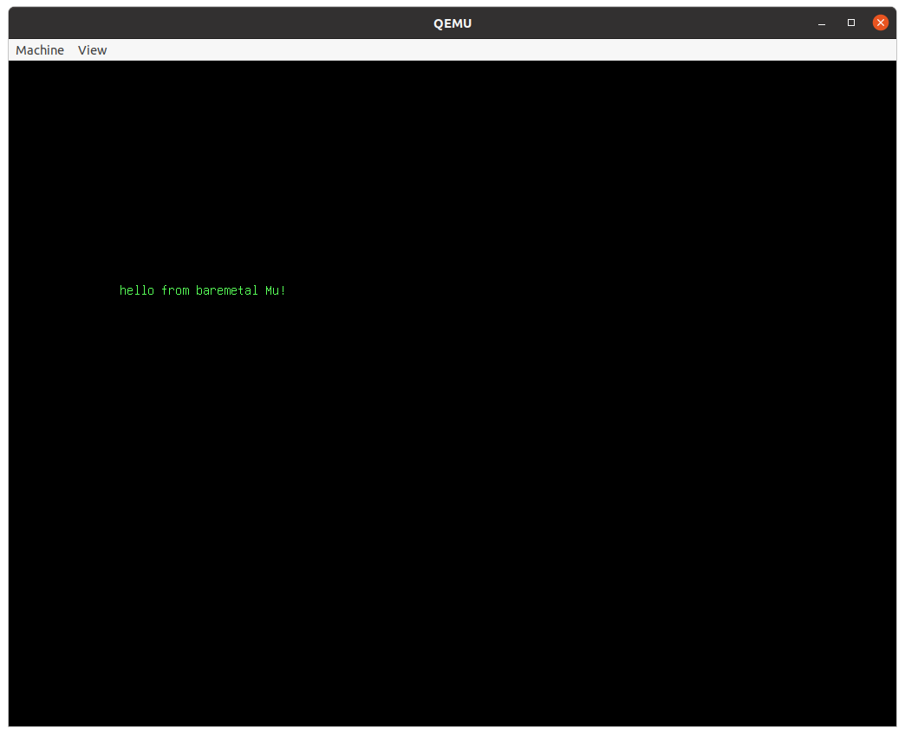
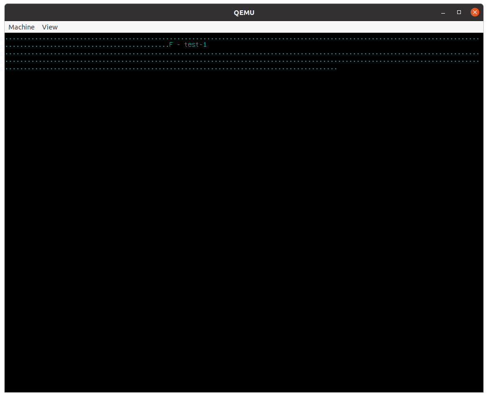
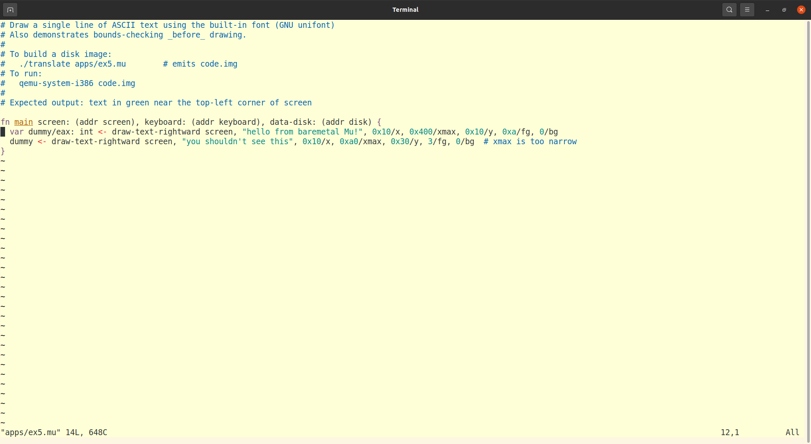
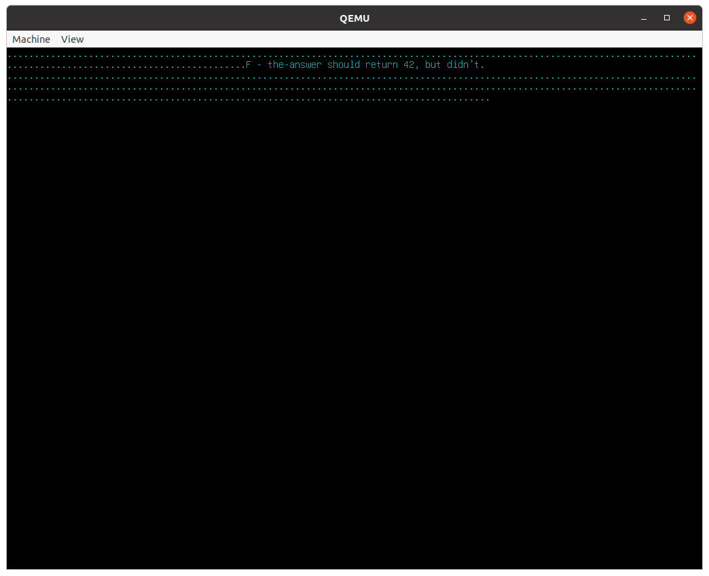

# A slow tour through Mu software on x86 computers

[Mu](https://github.com/akkartik/mu) shrinks all the software in a computer
until it can (in principle) fit in a single head. Sensible error messages with
as little code as possible, starting all the way from your (x86) processor's
instruction set. Everything easy to change to your needs
([habitable](http://akkartik.name/post/habitability)), everything easy to
check up on ([auditable](http://akkartik.name/post/neighborhood)).

This page is a guided tour through Mu's Readme and reference documentation.
We'll start out really slow and gradually accelerate as we build up skills. By
the end of it all, I hope you'll be able to program your processor to run some
small graphical programs. The programs will only use a small subset of your
computer's capabilities; there's still a lot I don't know and therefore cannot
teach. However, the programs will run on a _real_ processor without needing
any other intermediary software.

_Prerequisites_

You will need:

* A computer with an x86 processor running Linux. We're going to slowly escape
  Linux, but we'll need it at the start. Mu works on other platforms, but be
  warned that things will be _much_ (~20x) slower.
* Some fluency in typing commands at the terminal and interpreting their
  output.
* Fluency with some text editor. Things like undo, copying and pasting text,
  and saving work in files. A little experience programming in _some_ language
  is also handy.
* [Git](https://git-scm.com) for version control.
* [QEMU](https://www.qemu.org) for emulating a processor without Linux.
* Basic knowledge of number bases, and the difference between decimal and
  hexadecimal numbers.
* Basic knowledge of the inside of a processor, such as the difference between
  a small number of registers and a large number of locations in memory.

If you have trouble with any of this, [I'm always nearby and available to
answer questions](http://akkartik.name/contact). The prerequisites are just
things I haven't figured out how to explain yet. In particular, I want this
page to be accessible to people who are in the process of learning
programming, but I'm sure it isn't good enough yet for that. Ask me questions
and help me improve it.

## Task 1: getting started

Open a terminal and run the following commands to prepare Mu on your computer:

```
git clone https://github.com/akkartik/mu
cd mu
```

Run a small program to start:

```
./translate tutorial/task1.mu
qemu-system-i386 code.img
```

If you aren't on Linux, the command for creating `code.img` will be slightly
different:

```
./translate_emulated tutorial/task1.mu
qemu-system-i386 code.img
```

Either way, you should see this:



If you have any trouble at this point, don't waste _any_ time thinking about
it. Just [get in touch](http://akkartik.name/contact).

(You can look at `tutorial/task1.mu` at this point if you like. It's just 3
lines long. But don't worry if it doesn't make much sense.)

## Task 2: running tests

Here's a new program to run:

```
./translate tutorial/task2.mu
qemu-system-i386 code.img
```

(As before, I'll leave you to substitute `translate` with `translate_emulated`
if you're not on Linux.)

This time the screen will look like this:



Each of the dots represents a _test_, a little self-contained and automated
program run and its results verified. Mu comes with a lot of tests (every
function starting with 'test-' is a test), and it always runs all tests on
boot before it runs any program. You may have missed the dots when you ran
Task 1 because there were no failures. They were printed on the screen and
then immediately erased. In Task 2, however, we've deliberately included a
failing test. When any tests fail, Mu will immediately stop, showing you
messages from failing tests and implicitly asking you to first fix them.

(Don't worry just yet about what the message in the middle of all the dots means.)

## Task 3: configure your text editor

So far we haven't used a text editor yet, but we will now be starting to do
so. Before we do, it's worth spending a little bit of time setting your
preferred editor up to be a little more ergonomic. Mu comes with _syntax
highlighting_ settings for a few common text editors in the `editor/`
sub-directory. If you don't see your text editor there, or if you don't know
what to do with those files, [get in touch!](http://akkartik.name/contact)
Here's what my editor (Vim) looks like with these settings on the program of
Task 1:



It's particularly useful to highlight _comments_ which the computer ignores
(everything on a line after a `#` character) and _strings_ within `""` double
quotes.

## Task 4: your first Mu statement

Mu is a statement-oriented language. Read the first section of the [Mu syntax
description](https://github.com/akkartik/mu/blob/main/mu.md) (until the first
sub-heading, "functions and calls") to learn a little bit about it.

Here's a skeleton of a Mu function that's missing a single statement.

```
fn the-answer -> _/eax: int {
  var result/eax: int <- copy 0
  # insert your statement below {

  # }
  return result
}
```

Try running it now:
```
./translate tutorial/task4.mu
qemu-system-i386 code.img
```

(As before, I'll leave you to substitute `translate` with `translate_emulated`
if you're not on Linux.)

You should see a failing test that looks something like this:



Open `tutorial/task4.mu` in your text editor. Think about how to add a line
between the `{}` lines to make `the-answer` return 42. Rerun the above
commands. You'll know you got it right when all the tests pass, i.e. when the
rows of dots and text above are replaced by an empty screen.

Don't be afraid to run the above commands over and over again as you try out
different solutions. Here's a way to run them together so they're easy to
repeat.

```
./translate tutorial/task4.mu  &&  qemu-system-i386 code.img
```

In programming there is no penalty for making mistakes, and once you arrive at
the correct solution you have it forever. As always, [feel free to ping me and
ask questions or share your experience](http://akkartik.name/contact).

Mu statements can have _outputs_ on the left (before the `<-`) and _inouts_
(either inputs or outputs) on the right, after the instruction name. The order
matters.

One gotcha to keep in mind is that numbers in Mu must always be in hexadecimal
notation, starting with `0x`. Use a calculator on your computer or phone to
convert 42 to hexadecimal, or [this page on your web browser](http://akkartik.github.io/mu/tutorial/converter.html).

## Task 5: variables in registers, variables in memory

We'll now practice managing one variable in a register (like last time) and
a second one in memory. To prepare for this, reread the first section of the
[Mu syntax description](https://github.com/akkartik/mu/blob/main/mu.md), and
then its section on [local variables](https://github.com/akkartik/mu/blob/main/mu.md#local-variables).
The section on [integer primitives](https://github.com/akkartik/mu/blob/main/mu.md#integer-primitives)
also provides a useful cheatsheet of the different forms of instructions you
will need.

Here's the exercise, with comments starting with `#` highlighting the gaps in
the program:
```
fn foo -> _/eax: int {
  var x: int
  # statement 1: store 3 in x
  # statement 2: define a new variable 'y' in register eax and store 4 in it
  # statement 3: add y to x, storing the result in x
  return x
}
```

Again, you're encouraged to repeatedly try out your programs by running this
command as often as you like:
```
./translate tutorial/task5.mu  &&  qemu-system-i386 code.img
```

The section on [integer primitives](https://github.com/akkartik/mu/blob/main/mu.md#integer-primitives)
shows that Mu consistently follows a few rules:
* Instructions that write to a register always have an output before the `<-`.
* Instructions that use an argument in memory always have it as the first
  inout.
* Instructions that write to memory have a preposition in their name. Contrast
  `add` to a register vs `add-to` a memory location, `subtract` from a
  register vs `subtract-from` a memory location, and so on.

If you're stuck, as always, [my door is open](http://akkartik.name/contact).
You can also see a solution in the repository, though I won't link to it lest
it encourage peeking.

## Task 6: getting used to a few error messages

If you're like me, seeing an error message can feel a bit stressful. It
usually happens when you're trying to get somewhere, it can feel like the
computer is being deliberately obtrusive, there's uncertainty about what's
wrong.

Well, I'd like to share one trick I recently learned to stop fearing error
messages: deliberately trigger them at a time and place of your choosing, when
you're mentally prepared to see them. That takes the stress right out.

Here's the skeleton for `tutorial/task6.mu`:

```
fn main {
  var m: int
  var r/edx: int <- copy 0
  # insert a single statement below

}
```

(Reminder: `m` here is stored somewhere in memory, while `r` is stored in
register `edx`. Variables in registers must always be initialized when they're
created. Variables in memory must never be initialized, because they're always
implicitly initialized to 0.)

Now, starting from this skeleton, type the following statements in, one at a
time. Your program should only ever have one more statement than the above
skeleton. We'll try out the following statements, one by one:

* `m <- copy 3`
* `r <- copy 3`
* `copy-to r, 3`
* `copy-to m, 3`

Before typing in each one, write down whether you expect an error. After
trying it out, compare your answer. It can also be useful to write down the
exact error you see, and what it means, in your own words. Flipping the
"runbook" that way can be a useful aid to memory when you see an error for
real, during a real programming session.

(Also, don't forget to delete the statement you typed in before you move on to
trying out the next one.)

Runbooks are a handy tool for working with computers. In a runbook you write
instructions to your future self or for others you're working with. They're
instructions for programming people, not computers.

## Task 7: variables in registers, variables in memory (again)

Go back to your program in Task 5. Replace the first statement declaring
variable `x`:
```
var x: int
```

so it looks like this:
```
var x/edx: int <- copy 0
```

Run `translate` (or `translate_emulated`) as usual. Use your runbook from Task
6 to address the errors that arise.
